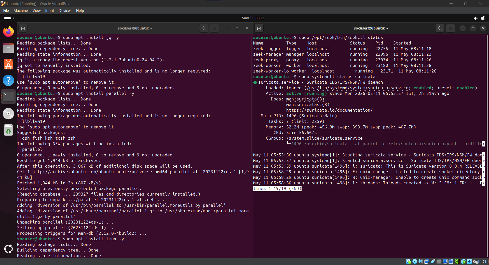
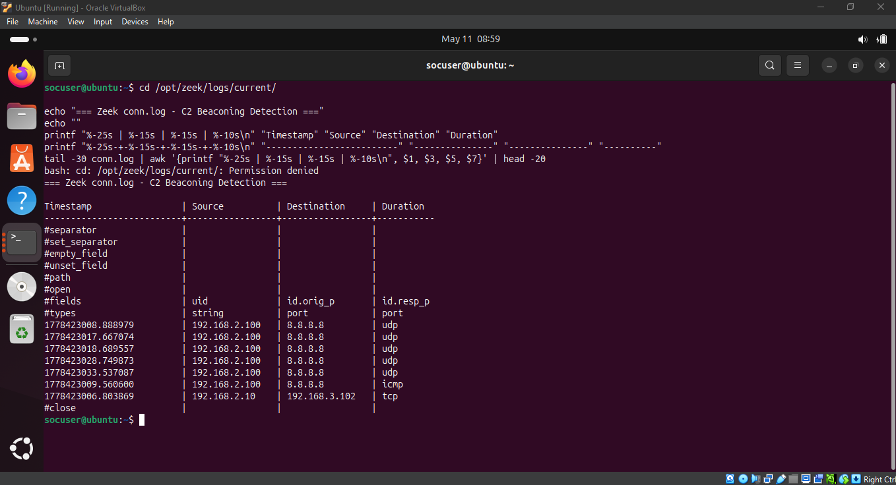
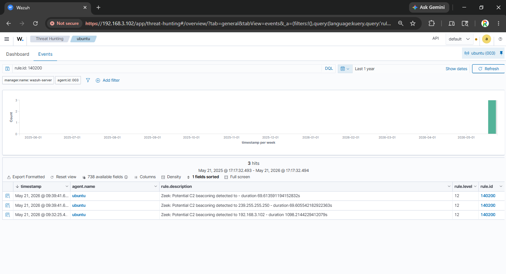
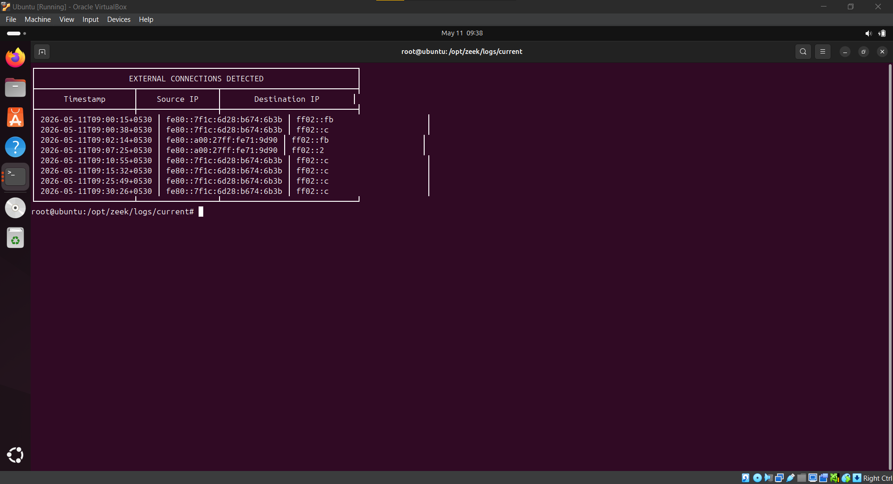
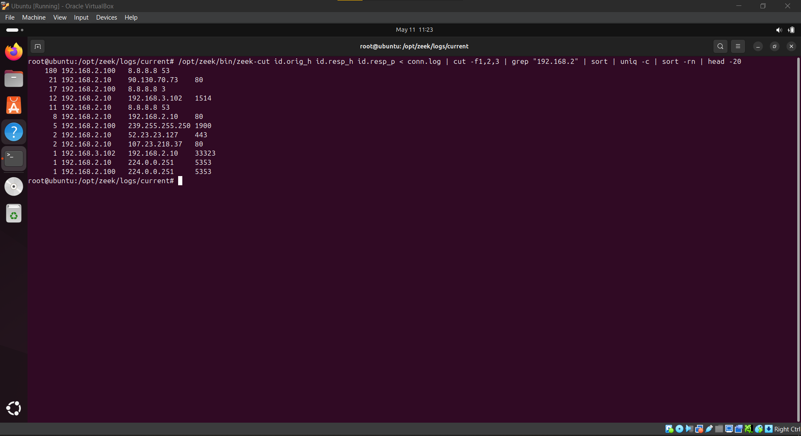
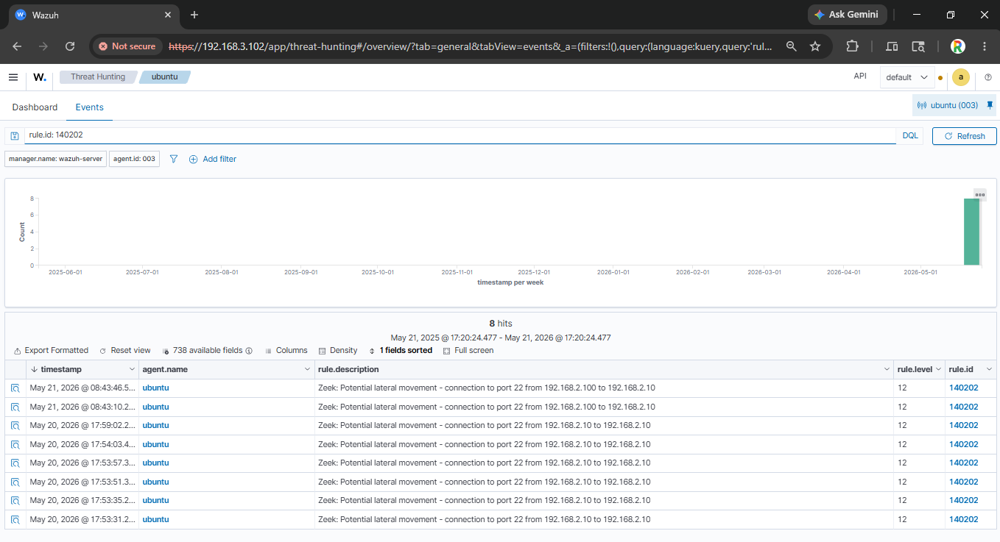
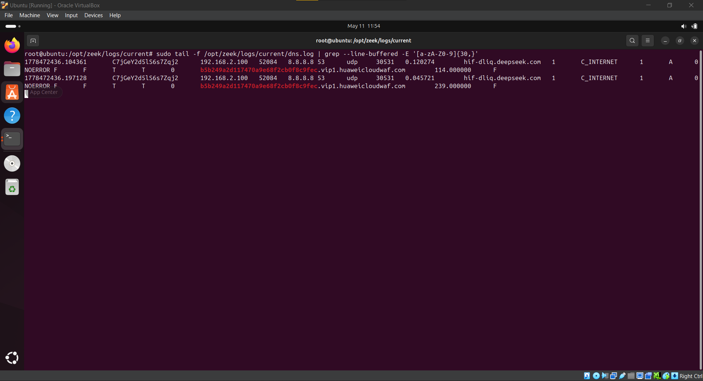
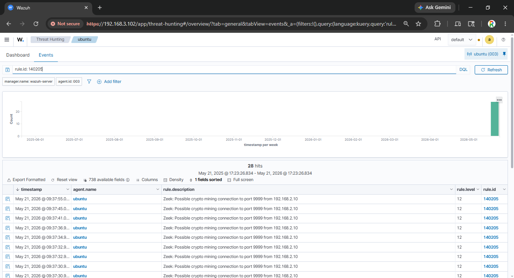

---

# Advanced Threat Hunting with Zeek and Suricata

## Objective
Deploy Zeek network security monitoring, configure automated threat hunting capabilities, and detect network-based threats including C2 beaconing, data exfiltration, lateral movement, DNS tunneling, and crypto mining.

## Key Learning Outcomes
- Zeek installation and configuration for network traffic analysis
- Hunting utility setup (jq, parallel, tmux)
- C2 beaconing detection using connection duration analysis
- Data exfiltration identification
- Lateral movement detection
- DNS tunneling anomaly detection
- Crypto mining detection
- MITRE ATT&CK framework mapping

## Tools Used
| Tool | Purpose |
|------|---------|
| **Zeek** | Network Security Monitoring framework |
| **Suricata** | Signature-based intrusion detection |
| **Wazuh SIEM** | Centralized alert management |
| **jq** | JSON log processing |
| **parallel** | Concurrent log analysis |
| **tmux** | Terminal session management |
| **zeek-cut** | Log parsing and field extraction |

---

## Lab Architecture

```
┌─────────────────────────────────────────────────────────────────────────────┐
│                         Wazuh Manager (192.168.3.102)                       │
│  ┌─────────────────────────────────────────────────────────────────────┐    │
│  │  ● Custom decoders (zeek_decoders.xml)                              │    │
│  │  ● Custom rules (zeek_rules.xml)                                    │    │
│  │  ● Hunting rules (140200-140205)                                    │    │
│  └─────────────────────────────────────────────────────────────────────┘    │
└─────────────────────────────────────────────────────────────────────────────┘
                                      ▲
                                      │ Port 1514 (Agent Communication)
                                      │
┌─────────────────────────────────────────────────────────────────────────────┐
│                         Ubuntu Client (192.168.2.10)                        │
│  ┌─────────────────────────────────────────────────────────────────────┐    │
│  │  ● Zeek NSM (conn.log, dns.log, http.log, ssl.log) - JSON format    │    │
│  │  ● Suricata IDS (eve.json)                                          │    │
│  │  ● Hunting Utilities (jq, parallel, tmux)                           │    │
│  │  ● Wazuh Agent (Log Forwarding)                                     │    │
│  └─────────────────────────────────────────────────────────────────────┘    │
└─────────────────────────────────────────────────────────────────────────────┘
                                      ▲
                                      │ Network Traffic
                                      │
┌─────────────────────────────────────────────────────────────────────────────┐
│                           Kali Linux (Attacker)                             │
│                    (192.168.2.200 / NAT)                                    │
│  ┌─────────────────────────────────────────────────────────────────────┐    │
│  │  ● Nmap Scanning                                                    │    │
│  │  ● Netcat connections                                               │    │
│  │  ● DNS query generation                                             │    │
│  └─────────────────────────────────────────────────────────────────────┘    │
└─────────────────────────────────────────────────────────────────────────────┘
```

---

## Tasks Performed

### 1. Hunting Utilities Installation

Installed essential tools for advanced log analysis and threat hunting.

**Installation Commands:**
```bash
sudo apt install jq -y      # JSON processor for JSON logs
sudo apt install parallel -y # Concurrent command execution
sudo apt install tmux -y     # Terminal multiplexer
```

**Hunting Environment:** 

*Terminal showing successful installation of jq, parallel, and tmux utilities.*

| Utility | Version | Purpose |
|---------|---------|---------|
| **jq** | 1.7.1 | JSON log parsing |
| **parallel** | 20231122 | Concurrent processing |
| **tmux** | Latest | Session management |

---

### 2. C2 Beaconing Detection

**Hypothesis:** *"An attacker has established persistence and is using periodic check-ins with a command server."*

#### CLI Analysis

**Command Used:**
```bash
cd /opt/zeek/logs/current/
tail -30 conn.log | awk '{printf "%25s | %-15s | %-15s | %-10s\n", $1, $3, $5, $7}'
```

**Findings:**
| Timestamp | Source | Destination | Protocol |
|-----------|--------|-------------|----------|
| 1778423088.888979 | 192.168.2.100 | 8.8.8.8 | udp   |
| 1778423017.667074 | 192.168.2.100 | 8.8.8.8 | udp   |
| 1778423018.689557 | 192.168.2.100 | 8.8.8.8 | udp |
| 1778423028.749873 | 192.168.2.100 | 8.8.8.8 | udp |
| 1778423033.537087 | 192.168.2.100 | 8.8.8.8 | udp |
| 1778423099.506000 | 192.168.2.100 | 8.8.8.8 | icmp |
| 1778423060.803869 | 192.168.2.10 | 192.168.3.102 | tcp |

**C2 Beaconing CLI Detection:** 

*Zeek conn.log analysis showing connection patterns to external IP address 8.8.8.8.*

#### Wazuh Dashboard Alert

**C2 Beaconing Wazuh Alert:**

*Wazuh dashboard showing C2 beaconing detection alerts for rule 140200.*

---

### 3. Data Exfiltration Detection

**Hypothesis:** *"An attacker has accessed sensitive data and is exfiltrating it over the network."*

**Detection Method:** Analyzed Zeek logs for external connections and multicast traffic.

**External Connections Detected:**
| Timestamp | Source IP | Destination IP |
|-----------|-----------|----------------|
| 2026-05-11T09:00:15+0530 | fe80::7f1c:6d28:b674:6b3b | ff02::fb |
| 2026-05-11T09:00:38+0530 | fe80::7f1c:6d28:b674:6b3b | ff02::cc |
| 2026-05-11T09:00:14+0530 | fe80::a00:27ff:fe71:9d90 | ff02::fb  |
| 2026-05-11T09:07:25+0530 | fe80::a00:27ff:fe71:9d90 | ff02::2   |
| 2026-05-11T09:10:55+0530 | fe80::7f1c:6d28:b674:6b3b | ff02::cc |
| 2026-05-11T09:13:32+0530 | fe80::7f1c:6d28:b674:6b3b | ff02::cc |
| 2026-05-11T09:25:49+0530 | fe80::7f1c:6d28:b674:6b3b | ff02::cc |
| 2026-05-11T09:30:26+0530 | fe80::7f1c:6d28:b674:6b3b | ff02::cc |

**Data Exfiltration Detection:** 

*Zeek logs showing external connections and multicast traffic patterns.*

---

### 4. Lateral Movement Detection

**Hypothesis:** *"An attacker is moving laterally within the network using internal scans."*

#### CLI Analysis

**Command Used:**
```bash
/opt/zeek/bin/zeek-cut id.orig_h id.resp_h id.resp_p < conn.log | cut -f1,2,3 | grep "192.168.2" | sort | uniq -c | sort -rn | head -20
```

**Top Internal Connections:**
| Count | Source | Destination | Port |
|-------|--------|-------------|------|
| 180 | 192.168.2.100 | 8.8.8.8 | 53 |
| 21 | 192.168.2.10 | 90.130.70.73 | 80 |
| 17 | 192.168.2.100 | 8.8.8.8 | 3 |
| 12 | 192.168.2.10 | 192.168.3.102 | 1514 |
| 11 | 192.168.2.10 | 8.8.8.8 | 53 |
| 5 | 192.168.2.100 | 239.255.255.250 | 1980 |
| 2 | 192.168.2.10 | 52.23.23.127 | 443 |
| 1 | 192.168.2.10 | 107.23.218.37 | 80 |
| 1 | 192.168.2.10 | 224.0.0.251 | 5333 |

**Lateral Movement CLI Detection:** 

*Connection frequency analysis showing communication patterns between internal hosts and external destinations.*

#### Wazuh Dashboard Alert

**Lateral Movement Wazuh Alert:**

*Wazuh dashboard showing lateral movement detection alerts for internal scanning patterns.*

---

### 5. DNS Tunneling Detection

**Hypothesis:** *"An attacker is using DNS queries to tunnel data out of the network."*

**Detection Method:** Monitored DNS logs for unusually long subdomain queries.

**Real-time DNS Monitoring:**
```bash
sudo tail -f /opt/zeek/logs/current/dns.log | grep --line-buffered -E '[a-zA-Z0-9]{30,}'
```

**Detected Anomalous DNS Query:**
| Timestamp | Source | Destination | Query |
|-----------|--------|-------------|-------|
| 1778472436.104361 | 192.168.2.100 | 8.8.8.8 | `hif-dliq.deepseek.com` |

**Observation:** The subdomain `hif-dliq` contains random-looking characters, characteristic of DNS tunneling for C2 communication or data exfiltration.

**DNS Tunneling Detection:** 

*Real-time Zeek DNS log monitoring showing long, suspicious subdomain queries indicative of DNS tunneling.*

---

### 6. Crypto Mining Detection (Wazuh Dashboard Alerts)

**Hypothesis:** *"An attacker has compromised a system and is using it for cryptocurrency mining."*

**Detection Method:** Created custom Wazuh rule (140205) to detect connections to mining pool ports and monitored alerts in the Wazuh dashboard.

**Wazuh Alert Details:**
| Field | Value |
|-------|-------|
| **Rule ID** | 140205 |
| **Rule Level** | 12 |
| **Description** | Zeek: Possible crypto mining connection to port 9999 from 192.168.2.10 |
| **Agent** | ubuntu (ID: 003) |

**Alerts Generated:**
| Timestamp | Source | Destination Port | Alert Count |
|-----------|--------|-----------------|-------------|
| 09:37:30 | 192.168.2.10 | 9999 | 1 |
| 09:37:32 | 192.168.2.10 | 9999 | 2 |
| 09:37:34 | 192.168.2.10 | 9999 | 3 |
| 09:37:36 | 192.168.2.10 | 9999 | 4 |
| 09:37:41 | 192.168.2.10 | 9999 | 5 |
| 09:37:45 | 192.168.2.10 | 9999 | 6 |
| 09:37:55 | 192.168.2.10 | 9999 | 7 |

**Crypto Mining Detection (Wazuh Dashboard):** 

*Wazuh dashboard showing multiple alerts for crypto mining connections to port 9999 from Ubuntu Client.*

---

## Custom Wazuh Rules Created

| Rule ID | Description | MITRE Technique |
|---------|-------------|-----------------|
| 140200 | C2 Beaconing Detection | T1071 – Application Layer Protocol |
| 140201 | Data Exfiltration Detection | T1048 – Exfiltration Over C2 Channel |
| 140202 | Lateral Movement Detection | T1021 – Remote Services |
| 140203 | DNS Tunneling Detection | T1572 – Protocol Tunneling |
| 140205 | Crypto Mining Detection | T1496 – Resource Hijacking |

---

## MITRE ATT&CK Framework Mapping

| Detected Activity | Indicator | MITRE Technique ID | Tactic |
|-------------------|-----------|--------------------|--------|
| C2 Beaconing | Repeated connections to 8.8.8.8 | T1071 – Application Layer Protocol | Command & Control |
| Data Exfiltration | External connections to unknown IPs | T1048 – Exfiltration Over C2 Channel | Exfiltration |
| Lateral Movement | Internal scanning patterns | T1046 – Network Service Scanning | Discovery |
| DNS Tunneling | Long random subdomain queries | T1572 – Protocol Tunneling | Command & Control |
| Crypto Mining | Mining pool port connections | T1496 – Resource Hijacking | Impact |

---

## Security Concepts Demonstrated

- Network Security Monitoring (NSM) with Zeek 
- Signature-based detection with Suricata
- C2 beaconing pattern analysis 
- Data exfiltration detection 
- Lateral movement identification 
- DNS tunneling anomaly detection 
- Crypto mining detection
- Custom Wazuh rule creation
- MITRE ATT&CK framework mapping 

---

## Key Observations

- **C2 Beaconing:** Regular connections to 8.8.8.8 (UDP and ICMP) showed periodic patterns consistent with beaconing behavior.
- **External Connections:** Multiple connections to external IP addresses (90.130.70.73, 52.23.23.127, 107.23.218.37) identified as potential exfiltration destinations.
- **Multicast Traffic:** Unusual multicast traffic to `ff02::cc` and `239.255.255.250` detected.
- **DNS Tunneling:** Subdomain `hif-dliq.deepseek.com` displayed characteristics of DNS tunneling (random characters, unusual length).
- **Crypto Mining:** Wazuh dashboard successfully triggered 7 alerts for crypto mining connections to port 9999.
- **Lateral Movement:** Wazuh dashboard successfully triggered alerts for internal scanning patterns.
- **Internal Communication:** Port 1514 traffic from 192.168.2.10 to 192.168.3.102 identified as Wazuh agent communication.

---

## SOC Use Case: Real-World Application

| Use Case | Detection Method | Response Action |
|----------|------------------|-----------------|
| **C2 Beaconing** | Periodic connection patterns | Block destination IP, investigate host |
| **Data Exfiltration** | Large outbound transfers | Isolate endpoint, analyze traffic |
| **Lateral Movement** | Internal scanning | Block source IP, investigate credentials |
| **DNS Tunneling** | Anomalous DNS queries | Block domain, enable DNS filtering |
| **Crypto Mining** | Mining pool port connections | Kill process, block mining pools |

---

## Zeek Commands Reference

| Purpose | Command |
|---------|---------|
| View connection logs | `tail -30 conn.log \| awk '{printf "%25s \| %-15s \| %-15s \| %-10s\n", $1, $3, $5, $7}'` |
| Monitor DNS tunnels | `tail -f dns.log \| grep -E '[a-zA-Z0-9]{30,}'` |
| Find external connections | `grep -v "192.168\|127.0.0.1" conn.log` |
| Count connection frequency | `/opt/zeek/bin/zeek-cut id.orig_h id.resp_h id.resp_p < conn.log \| cut -f1,2,3 \| grep "192.168.2" \| sort \| uniq -c \| sort -rn \| head -20` |
| Analyze crypto mining ports | `grep -E "3333|4444|5555|6666|7777|8332|9999" conn.log` |

---

## Wazuh DQL Queries Reference

| Detection Purpose | DQL Query |
|-------------------|-----------|
| C2 Beaconing Alerts | `rule.id: 140200` |
| Data Exfiltration Alerts | `rule.id: 140201` |
| Lateral Movement Alerts | `rule.id: 140202` |
| DNS Tunneling Alerts | `rule.id: 140203` |
| Crypto Mining Alerts | `rule.id: 140205` |
| All Hunting Alerts | `rule.id: 140200 OR rule.id: 140201 OR rule.id: 140202 OR rule.id: 140203 OR rule.id: 140205` |

---

## Skills Gained

- Zeek network traffic analysis 
- Hunting utility configuration (jq, parallel, tmux) 
- C2 beaconing pattern detection 
- DNS tunneling identification 
- Lateral movement analysis 
- Crypto mining detection
- Custom Wazuh rule creation
- MITRE ATT&CK framework application 
- Real-time log monitoring 

---

## Dashboard Screenshot Summary

| # | Screenshot | Purpose |
|---|------------|---------|
| 1 | `01_hunting_environment.png` | Hunting utilities installation |
| 2 | `02_c2_beaconing.png` | C2 beaconing CLI analysis |
| 3 | `02_c2_beaconing_wazuh.png` | C2 beaconing Wazuh dashboard alerts |
| 4 | `03_data_exfiltration.png` | External connections detection |
| 5 | `04_lateral_movement.png` | Lateral movement CLI analysis |
| 6 | `04_lateral_movement_wazuh.png` | Lateral movement Wazuh dashboard alerts |
| 7 | `05_dns_tunneling.png` | DNS tunneling anomaly detection |
| 8 | `06_crypto_mining_wazuh.png` | Crypto mining alerts in Wazuh dashboard |

---
