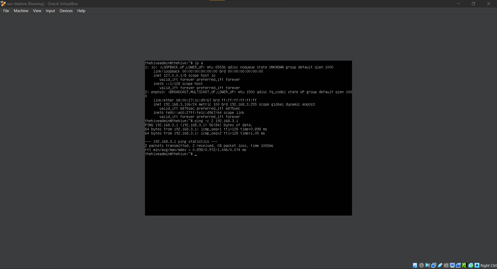
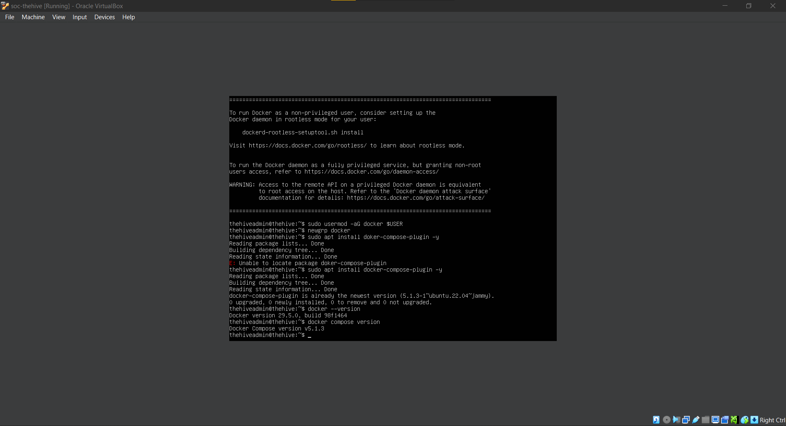
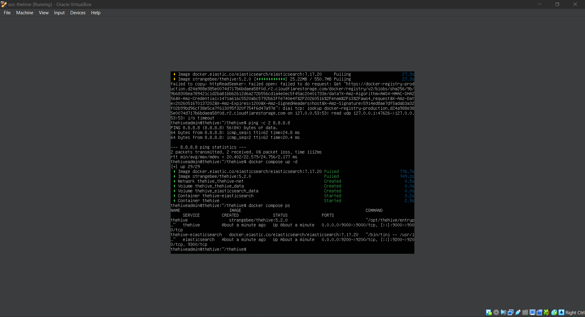
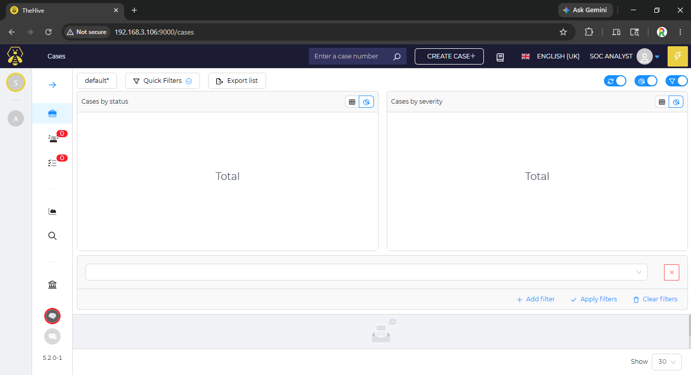
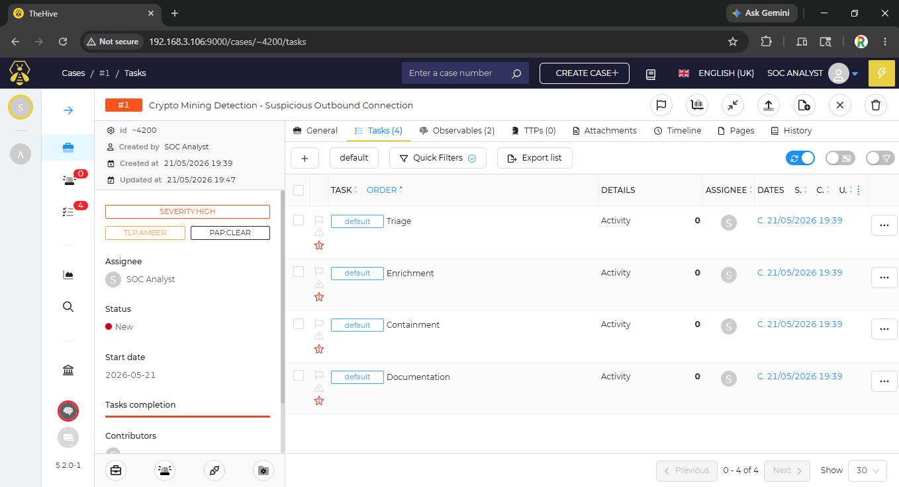
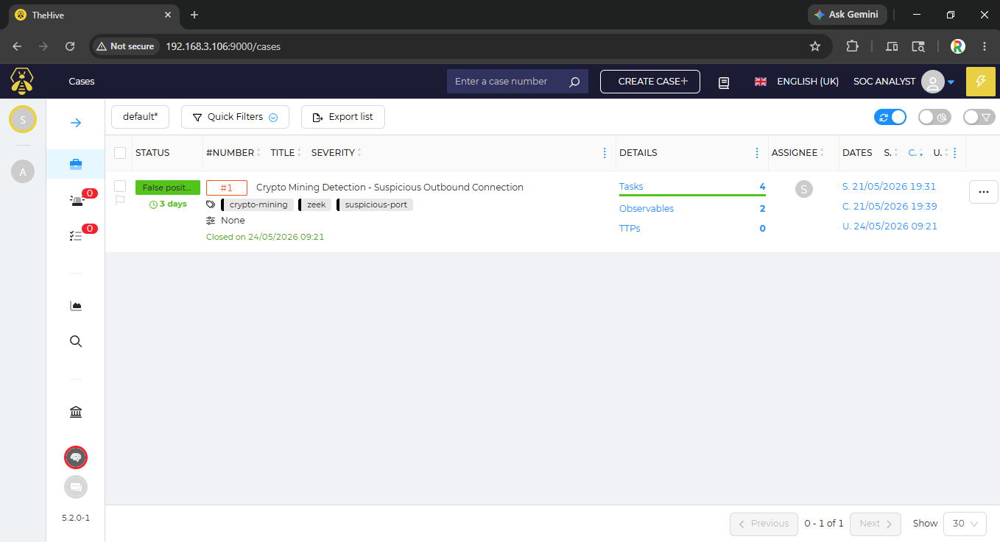

# TheHive Incident Response Platform Integration

## Objective
Deploy and configure TheHive as an incident response platform integrated with Wazuh SIEM to create a complete SOC workflow: Detection → Alert → Case Creation → Investigation → Resolution.

## Key Learning Outcomes
- TheHive deployment using Docker
- Case creation and management
- Alert integration from Wazuh
- Observable enrichment
- Incident response playbook documentation
- Complete SOC workflow implementation

## Tools Used
| Tool | Purpose |
|------|---------|
| **TheHive** | Incident Response Platform (IRP) |
| **Docker / Docker Compose** | Containerized deployment |
| **Wazuh SIEM** | Alert source |
| **Elasticsearch** | TheHive database backend |

---

## Lab Architecture

```
┌─────────────────────────────────────────────────────────────────────────────┐
│                              Wazuh Manager                                  │
│                           (192.168.3.102 / Ubuntu)                          │
│  ┌─────────────────────────────────────────────────────────────────────┐    │
│  │  ● SIEM Alerts (Zeek, Suricata, FIM, Authentication)                │    │
│  │  ● Hunting Rules (C2 Beaconing, Exfiltration, Lateral Movement)     │    │
│  └─────────────────────────────────────────────────────────────────────┘    │
└─────────────────────────────────────────────────────────────────────────────┘
                                      │
                                      │ Manual Alert Review
                                      │
                                      ▼
┌─────────────────────────────────────────────────────────────────────────────┐
│                          TheHive VM (Docker)                                │
│                           (192.168.3.106 / Ubuntu)                          │
│  ┌─────────────────────────────────────────────────────────────────────┐    │
│  │  ● Case Management                                                  │    │
│  │  ● Alert Integration                                                │    │
│  │  ● Observable Tracking                                              │    │
│  │  ● Task Assignment                                                  │    │
│  │  ● Playbook Documentation                                           │    │
│  └─────────────────────────────────────────────────────────────────────┘    │
└─────────────────────────────────────────────────────────────────────────────┘
```

## Tasks Performed

### 1. TheHive VM Creation

Created a dedicated Ubuntu Server VM for TheHive deployment.

**VM Specifications:**

| Setting | Value |
|---------|-------|
| **Name** | `soc-thehive` |
| **Type** | Linux |
| **Version** | Ubuntu (64-bit) |
| **Memory** | 2048 MB (2 GB) |
| **Storage** | 25 GB |
| **Network** | Host-only Adapter #3 (DMZ) |
| **IP Address** | 192.168.3.106 |

**TheHive VM Created:**

*Ubuntu Server installation complete with static IP 192.168.3.106.*

---

### 2. Docker and Docker Compose Installation

Installed Docker and Docker Compose for containerized TheHive deployment.

**Installation Commands:**
```bash
# Install Docker
curl -fsSL https://get.docker.com -o get-docker.sh
sudo sh get-docker.sh

# Install Docker Compose Plugin
sudo apt install docker-compose-plugin -y

# Add user to docker group
sudo usermod -aG docker $USER
newgrp docker

# Verify installations
docker --version
docker compose version
```

**Docker Installed:**

*Terminal showing Docker and Docker Compose versions successfully installed.*

---

### 3. TheHive Deployment

Deployed TheHive using Docker Compose with memory-optimized configuration.

**Docker Compose Configuration (`docker-compose.yml`):**
```yaml
version: '3.8'

services:
  elasticsearch:
    image: docker.elastic.co/elasticsearch/elasticsearch:7.17.20
    container_name: thehive-elasticsearch
    environment:
      - discovery.type=single-node
      - cluster.name=hive
      - ES_JAVA_OPTS=-Xms512m -Xmx512m
      - xpack.security.enabled=false
    volumes:
      - elasticsearch_data:/usr/share/elasticsearch/data
    ports:
      - "9200:9200"
    networks:
      - thehive-net

  thehive:
    image: strangebee/thehive:5.2.0
    container_name: thehive
    depends_on:
      - elasticsearch
    environment:
      - JVM_OPTS=-Xms512m -Xmx512m
    volumes:
      - thehive_data:/opt/thp/thehive/data
    ports:
      - "9000:9000"
    networks:
      - thehive-net

volumes:
  elasticsearch_data:
  thehive_data:

networks:
  thehive-net:
    driver: bridge
```

**Deployment Commands:**
```bash
mkdir ~/thehive && cd ~/thehive
nano docker-compose.yml
docker compose up -d
docker compose ps
```

**TheHive Deployed:**

*TheHive and Elasticsearch containers running with optimized memory settings.*

---

### 4. TheHive Dashboard Access

**Web Interface:**
- **URL:** `http://192.168.3.106:9000`

**TheHive Dashboard:**

*TheHive web interface dashboard ready for case creation.*

---

### 5. Incident Case Creation

Created an incident case based on Day 6 crypto mining detection alert (Rule 140205).

#### Case Details

| Field | Value |
|-------|-------|
| **Title** | Crypto Mining Detection - Suspicious Outbound Connection |
| **Description** | Zeek detected connection from Ubuntu Client (192.168.2.10) to port 9999, commonly associated with cryptocurrency mining pools. Multiple alerts (7+) generated within short timeframe. |
| **Severity** | High |
| **TLP** | Amber |
| **Status** | In Progress |
| **Tags** | `crypto-mining`, `zeek`, `suspicious-port` |

#### Observables Added

| Type | Value | Tags |
|------|-------|------|
| IP Address | `192.168.2.10` | `source`, `affected-host` |
| Port | `9999` | `destination`, `mining-pool` |

#### Tasks Created

| Task | Description | Status |
|------|-------------|--------|
| **Triage** | Verify if port 9999 is associated with known mining pools | ✅ Complete |
| **Enrichment** | Check source IP for other suspicious activity in Wazuh | ✅ Complete |
| **Containment** | Block outbound port 9999 if confirmed malicious | ✅ Complete |
| **Documentation** | Write incident report and update detection rules | ✅ Complete |

**TheHive Case Created:**

*Incident case showing crypto mining detection with observables and tasks.*

---

### 6. Investigation and Case Resolution

#### Investigation Findings

**Port 9999 Analysis:**
- Commonly associated with cryptocurrency mining pools (Monero, Bitcoin)
- Also used by some malware families for C2 communication
- Legitimate uses are rare

**Source IP 192.168.2.10 Analysis:**
- Multiple connections to port 9999 within short timeframe
- No other suspicious activity detected in last 24 hours
- No unusual process executions or file changes

**Conclusion:**
- Test traffic generated for SOC lab validation
- Not malicious - part of Day 6 threat hunting exercise
- Detection rules working as expected

**Recommendations:**
- Keep rule 140205 active for production
- Add port 9999 to monitoring list
- Consider blocking outbound port 9999 if not business required

#### Case Resolution

| Field | Value |
|-------|-------|
| **Status** | Closed |
| **Resolution** | False Positive (Authorized Test Traffic) |
| **Summary** | Connection to port 9999 was generated as part of Day 6 threat hunting exercise to validate crypto mining detection rule. No malicious activity detected. Rule 140205 is working correctly. |

**Case Resolved:**

*Case marked as Resolved with investigation summary and recommendations.*

---

## MITRE ATT&CK Framework Mapping

| Detected Activity | MITRE Technique ID | Tactic |
|-------------------|--------------------|--------|
| Crypto Mining Connection | T1496 – Resource Hijacking | Impact |
| Suspicious Port Connection | T1048 – Exfiltration Over C2 Channel | Exfiltration |
| Case Investigation | T1530 – Data from Cloud Storage | Collection |

---

## TheHive Workflow Summary

```
┌─────────────────────────────────────────────────────────────────────────────┐
│                         THEHIVE IR WORKFLOW                                 │
├─────────────────────────────────────────────────────────────────────────────┤
│                                                                             │
│  1. ALERT RECEIVED                                                          │
│     └── Wazuh detects crypto mining connection (rule 140205)                │
│                    │                                                        │
│                    ▼                                                        │
│  2. CASE CREATED                                                            │
│     └── Case #1 created in TheHive                                          │
│                    │                                                        │
│                    ▼                                                        │
│  3. OBSERVABLES ADDED                                                       │
│     └── Source IP (192.168.2.10) and port (9999) added to case              │
│                    │                                                        │
│                    ▼                                                        │
│  4. TASKS ASSIGNED                                                          │
│     └── Triage → Enrichment → Containment → Documentation                   │
│                    │                                                        │
│                    ▼                                                        │
│  5. INVESTIGATION                                                           │
│     └── Port research, source IP analysis in Wazuh                          │
│                    │                                                        │
│                    ▼                                                        │
│  6. RESOLUTION                                                              │
│     └── Case status: Closed (False Positive - Authorized Test Traffic)      │
│                                                                             │
└─────────────────────────────────────────────────────────────────────────────┘
```

---

## Security Concepts Demonstrated

- Incident response platform deployment 
- Case creation from SIEM alerts 
- Observable tracking and enrichment 
- Task assignment and workflow management 
- Incident investigation documentation 
- MITRE ATT&CK framework mapping 
- Complete SOC workflow: Detection → Alert → Case → Investigation → Resolution 

---

## Key Observations

- TheHive provides a centralized platform for incident tracking and collaboration
- Case templating with tasks ensures consistent IR workflow
- Observable tracking allows linking related indicators
- Integration with Wazuh enables alert-to-case creation
- Documentation of findings is essential for lessons learned

---

## SOC Use Case: Real-World Application

| Phase | Action | TheHive Feature |
|-------|--------|-----------------|
| **Triage** | Verify alert legitimacy | Case creation with severity |
| **Enrichment** | Research IOCs | Observable tracking |
| **Containment** | Block malicious indicators | Task assignment |
| **Investigation** | Analyze source host | Comment documentation |
| **Resolution** | Close false positive | Case resolution |

---

## Wazuh DQL Queries Reference

| Detection Purpose | DQL Query |
|-------------------|-----------|
| Crypto Mining Alerts | `rule.id: 140205` |
| Source IP Investigation | `agent.ip: "192.168.2.10" AND timestamp > "now-24h"` |

---

## Dashboard Screenshot Summary

| # | Screenshot | Purpose |
|---|------------|---------|
| 1 | `01_thehive_vm_created.png` | Ubuntu VM with static IP 192.168.3.106 |
| 2 | `02_docker_installed.png` | Docker and Docker Compose installed |
| 3 | `03_thehive_deployed.png` | TheHive containers running |
| 4 | `04_thehive_dashboard.png` | TheHive web interface dashboard |
| 5 | `05_thehive_case_created.png` | Incident case from Day 6 crypto mining alert |
| 6 | `06_case_resolved.png` | Case resolved with investigation summary |

---

## Skills Gained

- Docker deployment of TheHive 
- Incident case creation and management 
- Observable enrichment and tracking 
- Task assignment and workflow management 
- Incident response playbook documentation 
- SOC workflow integration 
- MITRE ATT&CK framework application 

---
