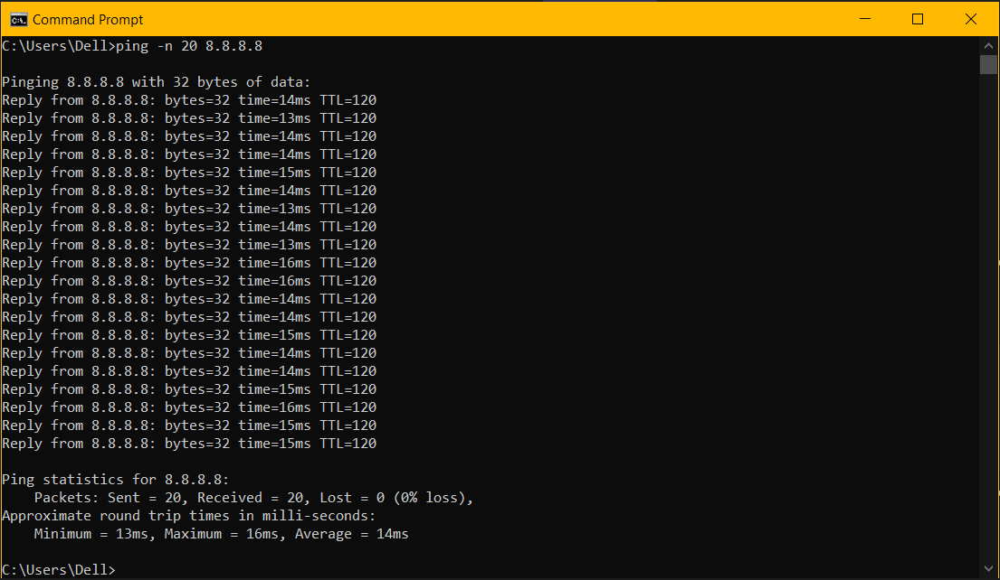
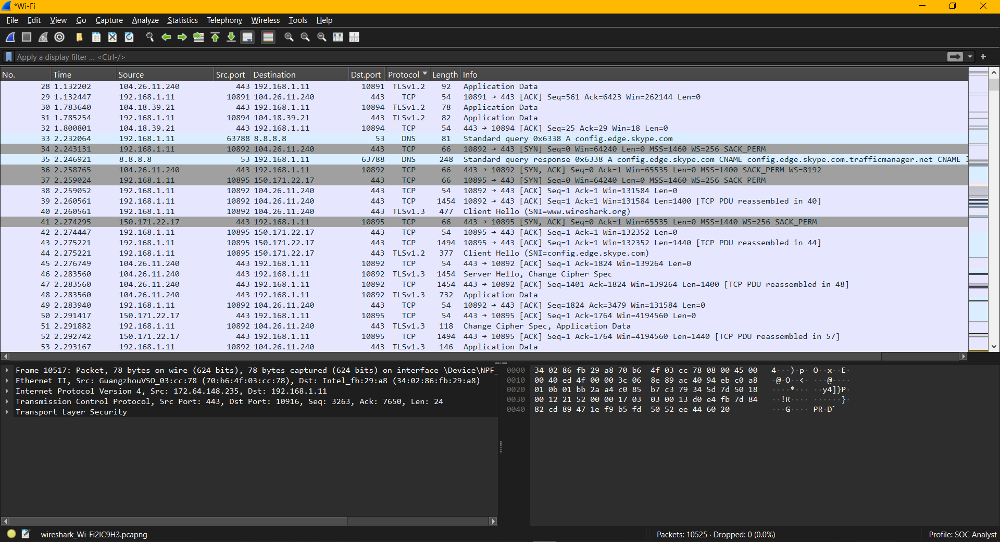
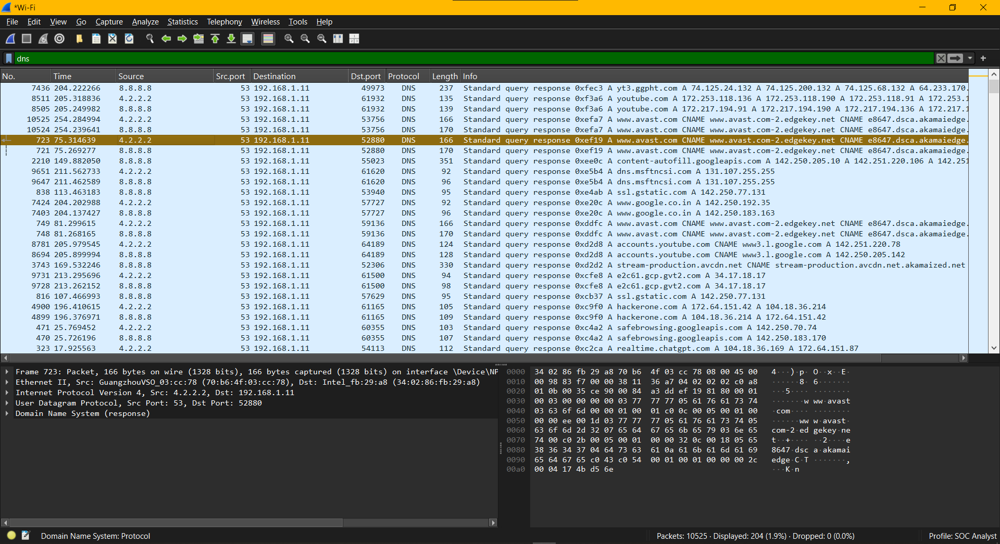
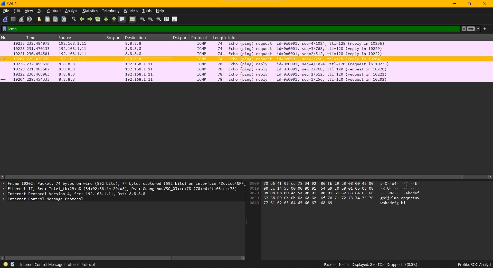
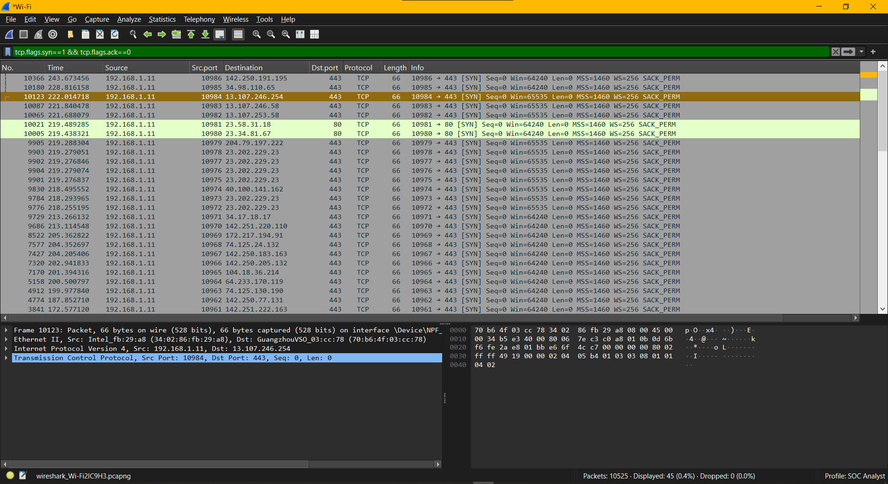
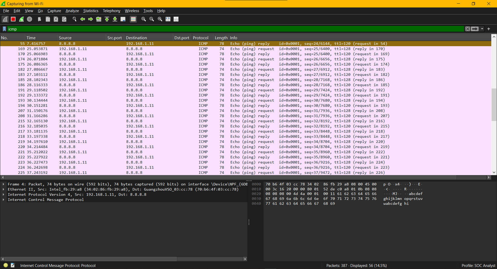

# Day 1 – Networking Foundations for SOC Analysts

## Objective
Develop practical skills in **network traffic analysis and threat detection** using Wireshark, focusing on identifying baseline behavior and detecting anomalies relevant to SOC operations.

## Key Learning Outcomes
- Alert triage
- Incident investigation
- Threat detection
- Network-based attack identification

## Tools Used
- **Wireshark** – Network packet capture & analysis
- **Windows Command Line / PowerShell** – Traffic generation
- **Public DNS (8.8.8.8)** – Connectivity testing

---

## Tasks Performed

### 1. Live Packet Capture
- Captured real-time network traffic on the active interface.
- Generated traffic by browsing websites and sending ICMP requests.
- Verified packet flow and correct interface selection.

**Commands Used:** Command Line  
`ping -n 20 8.8.8.8`

  

### 2. Protocol Analysis
Applied Wireshark filters to analyze traffic commonly monitored in SOC environments.

| Protocol | Filter Used | SOC Relevance |
| :--- | :--- | :--- |
| DNS | `dns` | Detects command-and-control, data exfiltration |
| ICMP | `icmp` | Detects reconnaissance and DoS attacks |
| TCP | `tcp` | Session establishment, brute force attempts |
| HTTPS | `tcp.port == 443` | Encrypted communication monitoring |

**DNS Traffic:**

*Shows DNS query and response behavior. Useful for detecting C2 communication and data exfiltration attempts.*

**ICMP Traffic:**

**TCP Handshake:**

### 3. TCP Three-Way Handshake Analysis
- Identified `SYN → SYN-ACK → ACK` sequence.
- Determined:
  - Initiating client
  - Destination server
  - Service ports
- Noted abnormal/incomplete handshakes may indicate:
  - Port scanning
  - SYN flood attacks

**Wireshark Filter Command:** `tcp.flags.syn==1 && tcp.flags.ack==0`

### 4. Normal vs Suspicious Traffic Evaluation

**Baseline normal traffic:**
- Standard DNS query patterns
- Normal ICMP request frequency
- Completed TCP sessions

**Suspicious activity to monitor:**
- Repeated DNS queries to same domain
- High-frequency ICMP traffic
- Multiple SYN packets without completing handshake
- Connections to unusual or unknown external IPs

*Observed repeated DNS queries and high-frequency ICMP traffic, which may indicate reconnaissance or potential data exfiltration behavior.*

---

## Security Concepts Demonstrated
- Network reconnaissance detection
- Protocol-level traffic analysis
- Baseline behavior identification
- Early-stage attack awareness
- SOC triage mindset

## Key Observations
- DNS traffic is a valuable indicator for malware or C2 detection.
- ICMP traffic can be abused for scanning and flooding.
- TCP handshake analysis helps detect abnormal connection attempts.
- Establishing normal network patterns is essential before writing or tuning SIEM rules.

## Skills Gained
- Packet capture & filtering
- Network traffic interpretation
- SOC-style traffic analysis
- Threat detection mindset
- Documentation & reporting

## Real SOC Use Case
In a real SOC environment, this analysis helps:
- Identify Command-and-Control (C2) communication via DNS
- Detect scanning activity using ICMP or TCP SYN patterns
- Investigate suspicious outbound connections
- Support alert triage and incident investigation workflows
