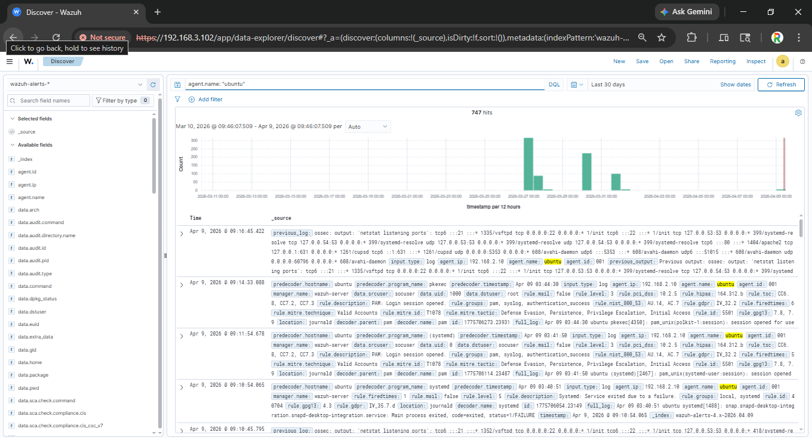
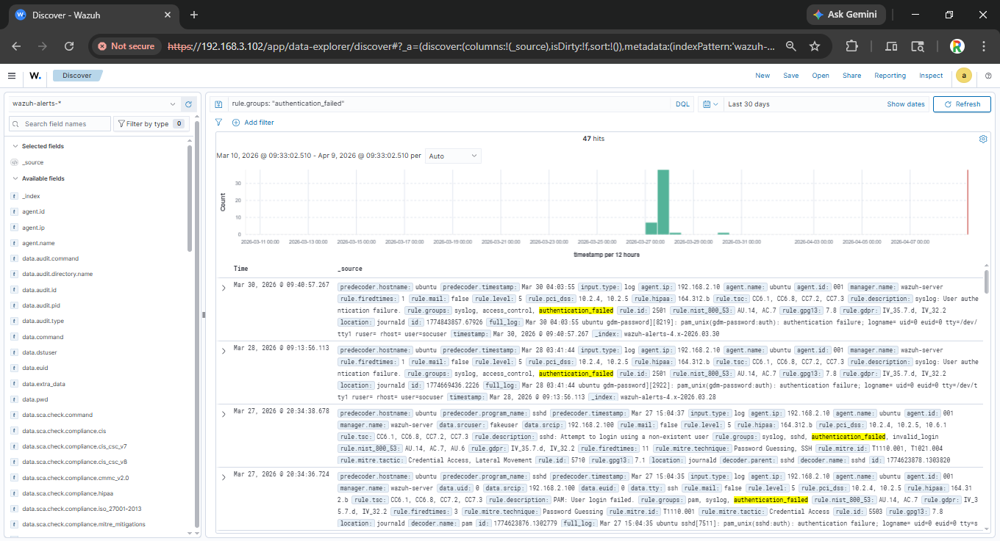
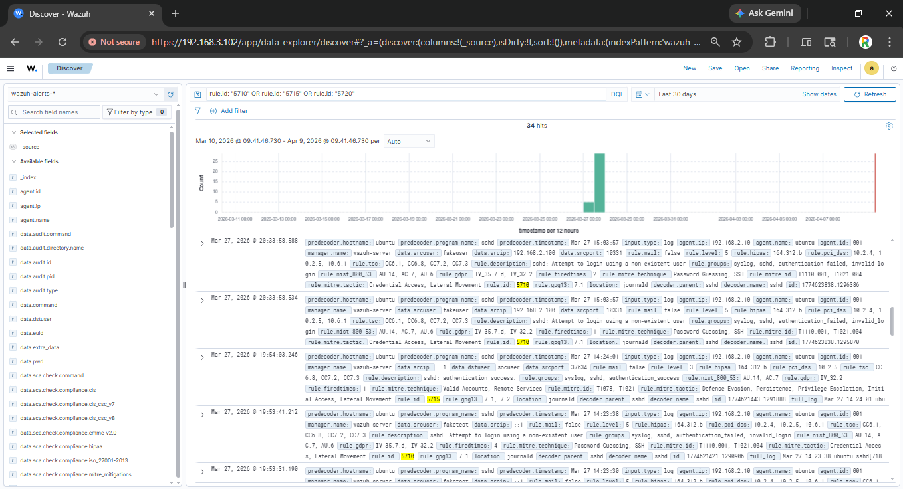
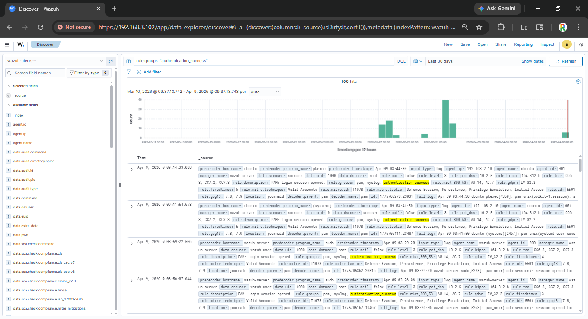
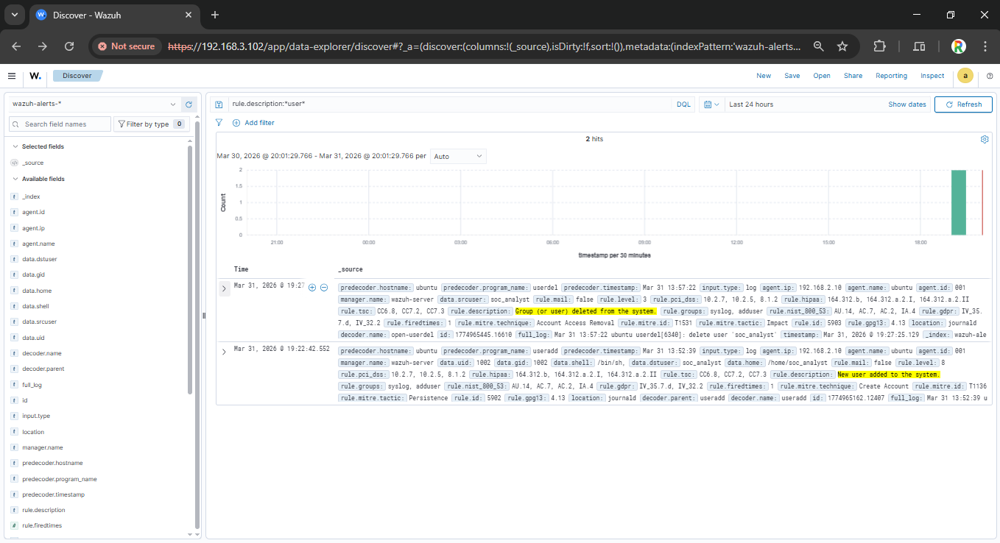
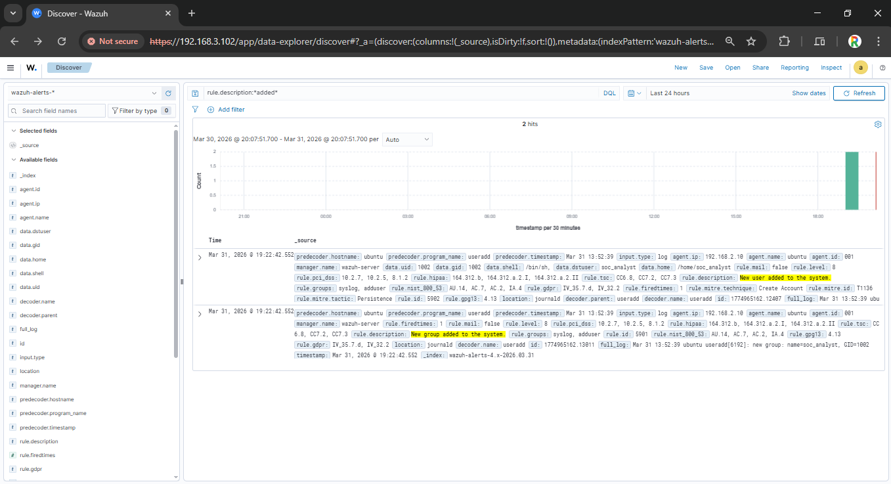
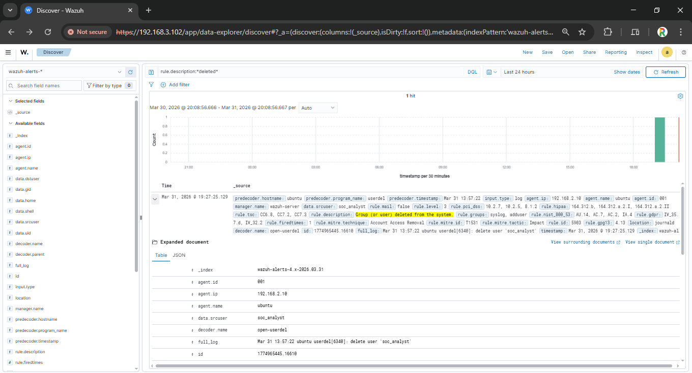
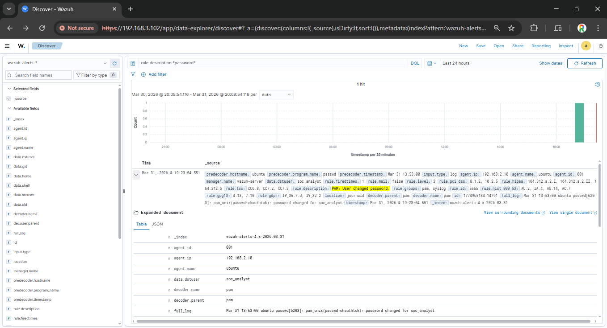
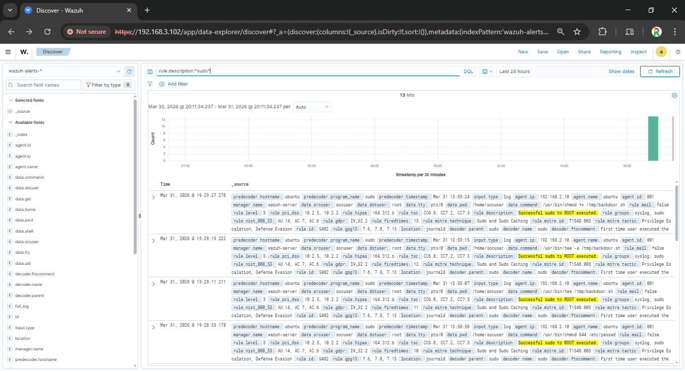
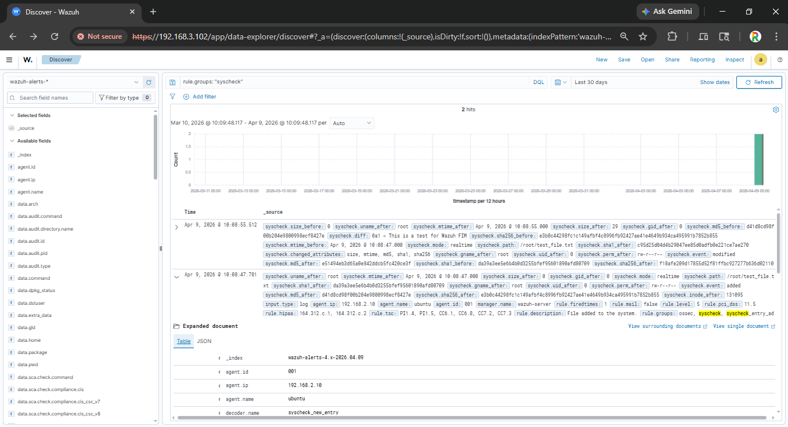

# Day 2 – SIEM Log Analysis for SOC Analysts (Wazuh)

## Objective
Develop practical skills in security event monitoring and log analysis using Wazuh SIEM, focusing on detecting authentication anomalies, user account changes, and privilege escalation attempts relevant to SOC operations.

## Key Learning Outcomes
- SIEM log ingestion and analysis
- Authentication failure detection
- User account monitoring
- Privilege escalation identification
- MITRE ATT&CK framework mapping

## Tools Used
- **Wazuh SIEM** – Security Information & Event Management
- **Ubuntu Client** – Monitored endpoint with Wazuh agent
- **Wazuh Dashboard (OpenSearch)** – Log visualization & filtering
- **DQL (OpenSearch Query Language)** – Event searching

---

## Tasks Performed

### 1. Wazuh Agent Connectivity Verification
- Verified Wazuh agent on Ubuntu Client was active and communicating with Wazuh server.
- Confirmed log collection from `/var/log/auth.log`, `/var/log/syslog`, and custom command monitoring.

**Wazuh Dashboard – Agent Status:**  
  
*Shows active agent connection and event flow from Ubuntu Client to Wazuh server.*

**Agent Connectivity Query:**  
rule.id: 503 OR rule.id: 506

### 2. Authentication Monitoring (Failed Logins)

Applied Wazuh filters to detect failed authentication attempts, a key indicator of brute force attacks and credential stuffing.

**Event Type: Failed SSH Login**  
**Wazuh Filter:** `rule.groups: "authentication_failed"`  
**SOC Relevance:** Detects brute force attempts

**Event Type: Failed Sudo Attempt**  
**Wazuh Filter:** `data.audit.success: "no"`  
**SOC Relevance:** Identifies privilege escalation attempts

**Event Type: Multiple Failures (Same IP)**  
**Wazuh Filter:** `rule.id: 5710`  
**SOC Relevance:** Confirms active brute force attack

**Failed Login Events:**  
  
*Shows multiple failed SSH authentication attempts from localhost, indicating simulated brute force activity.*

**Multiple Failed Logins from Same IP:**  
  
*Critical SOC alert – Multiple authentication failures from single source within short timeframe suggests active password spraying or brute force attack.*

### 3. Successful Authentication Monitoring

Tracked successful logins to establish baseline user behavior and detect unauthorized access.

**Successful Login Events:**  
  
*Shows successful sudo authentication events, useful for establishing user behavior baselines.*

**Successful Login Query:**  
rule.id: 5402 OR rule.id: 5501

### 4. User Account Management Monitoring

Detected user account creation, modification, and deletion – critical for identifying persistence mechanisms and insider threats.

**Event Type: User Created**  
**Wazuh Filter:** `data.audit.command: "useradd"`  
**MITRE ATT&CK Technique:** T1136 – Create Account

**Event Type: User Deleted**  
**Wazuh Filter:** `data.audit.command: "userdel"`  
**MITRE ATT&CK Technique:** T1531 – Account Removal

**Event Type: Password Changed**  
**Wazuh Filter:** `data.audit.command: "passwd"`  
**MITRE ATT&CK Technique:** T1098 – Account Manipulation

**User Management Events:**  
  
*Comprehensive view of user account activities including addition, deletion, and modification events.*

**User Added – Suspicious Account Creation:**  
  
*Detection of new user hacker123 creation – simulates attacker establishing persistence on compromised system.*

**User Deleted – Account Removal:**  
  
*Tracking account deletion events helps identify cleanup activities after privilege escalation.*

**Password Change Detection:**  
  
*Monitoring password modifications helps detect unauthorized account access and manipulation.*

### 5. Privilege Escalation Monitoring (Sudo Usage)

Detected sudo command executions – critical for identifying privilege escalation attempts.

**Sudo Usage Events:**  
  
*Shows successful sudo executions to root, mapping directly to MITRE ATT&CK technique T1548 – Abuse Elevation Control Mechanism.*

**Privilege Escalation Query:**  
rule.id: 5402 AND data.command: sudo

### 6. File Integrity Monitoring (FIM)

Detected changes to critical system files – essential for compliance (PCI-DSS, HIPAA, SOC2).

**File Changes Detected:**  
  
*File Integrity Monitoring alert showing modifications to `/root/test_file.txt` – critical for detecting unauthorized system changes.*

**FIM Query:**  
rule.groups: "syscheck" AND syscheck.path: *

## Normal vs Suspicious Activity Evaluation

**Activity Type: Failed Logins**  
**Normal Baseline:** 0-2 occasional typos  
**Suspicious Indicator:** 5+ failures in < 1 minute

**Activity Type: User Creation**  
**Normal Baseline:** Planned, documented  
**Suspicious Indicator:** Unannounced, unusual usernames

**Activity Type: Sudo Usage**  
**Normal Baseline:** Known admin users  
**Suspicious Indicator:** Unusual user accounts elevating

**Activity Type: File Changes**  
**Normal Baseline:** Approved changes  
**Suspicious Indicator:** Unexpected modifications to `/etc/`, `/root/`

**Activity Type: Password Changes**  
**Normal Baseline:** Self-service, verified  
**Suspicious Indicator:** Multiple changes, unusual timing

**Observed Suspicious Patterns:**
- 5+ failed SSH attempts from same source (Brute force indicator)
- New user hacker123 created with sudo privileges (Persistence mechanism)
- Multiple sudo commands from non-standard user (Privilege escalation)
- Unexpected file creation in `/root/` directory (Unauthorized access)

## MITRE ATT&CK Framework Mapping

**Detected Activity: Multiple failed logins**  
**MITRE Technique ID:** T1110 – Brute Force  
**Tactic:** Credential Access

**Detected Activity: New user created**  
**MITRE Technique ID:** T1136 – Create Account  
**Tactic:** Persistence

**Detected Activity: Sudo to root**  
**MITRE Technique ID:** T1548.003 – Sudo and Sudo Caching  
**Tactic:** Privilege Escalation

**Detected Activity: Password change**  
**MITRE Technique ID:** T1098 – Account Manipulation  
**Tactic:** Persistence

**Detected Activity: File modifications**  
**MITRE Technique ID:** T1565 – Data Manipulation  
**Tactic:** Impact

**Detected Activity: User deletion**  
**MITRE Technique ID:** T1531 – Account Removal  
**Tactic:** Impact

## Security Concepts Demonstrated
- SIEM log aggregation and normalization
- Authentication anomaly detection
- User account lifecycle monitoring
- Privilege escalation identification
- File integrity monitoring for compliance
- MITRE ATT&CK framework mapping

## Key Observations
- Failed authentication monitoring is the first line of defense against brute force attacks.
- User account creation without proper authorization indicates potential persistence mechanisms.
- Sudo usage tracking helps identify privilege escalation attempts in real-time.
- File Integrity Monitoring is essential for compliance (PCI-DSS 11.5, HIPAA 164.312.c.1).
- Multiple failures from same IP is a critical SOC alert requiring immediate investigation.

## SOC Use Case: Real-World Application

In a real SOC environment, this analysis enables:

**Use Case: Brute Force Attack**  
**Detection Method:** 5+ failed logins (same source)  
**Response Action:** Block source IP, reset compromised accounts

**Use Case: Insider Threat**  
**Detection Method:** Unauthorized user creation  
**Response Action:** Investigate, disable suspicious accounts

**Use Case: Privilege Escalation**  
**Detection Method:** Unusual sudo usage  
**Response Action:** Review sudoers file, revoke unauthorized privileges

**Use Case: Ransomware Detection**  
**Detection Method:** Mass file changes (FIM alerts)  
**Response Action:** Isolate endpoint, initiate IR playbook

**Use Case: Account Takeover**  
**Detection Method:** Password change + successful login  
**Response Action:** Force password reset, enable MFA

## Skills Gained
- SIEM log analysis and filtering
- Authentication event correlation
- User account monitoring
- Privilege escalation detection
- MITRE ATT&CK mapping
- Security incident documentation
