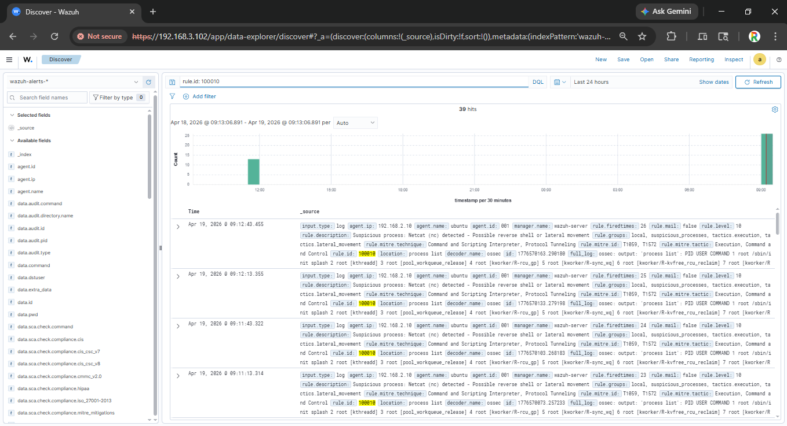
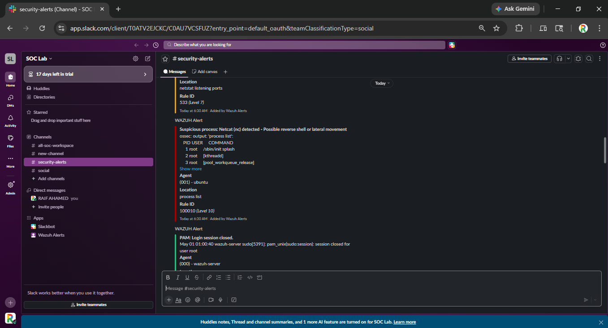
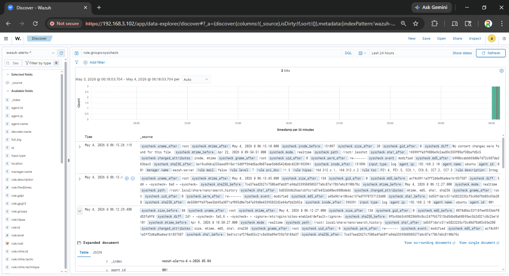
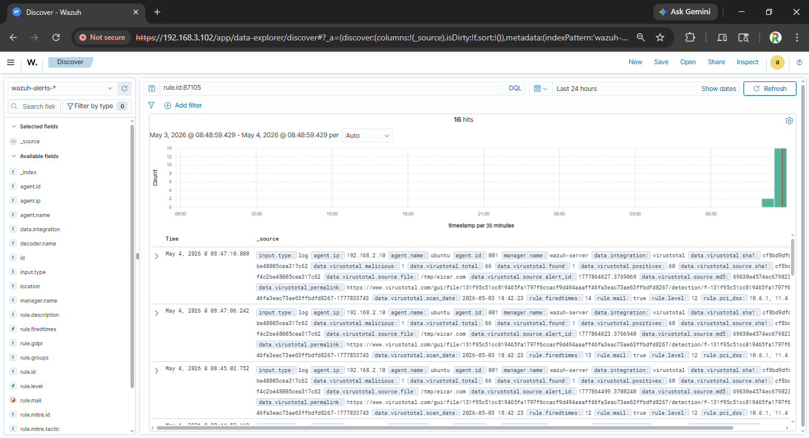
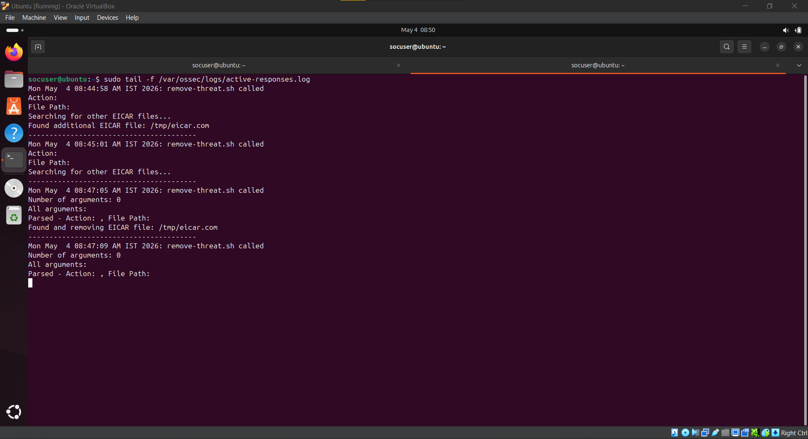
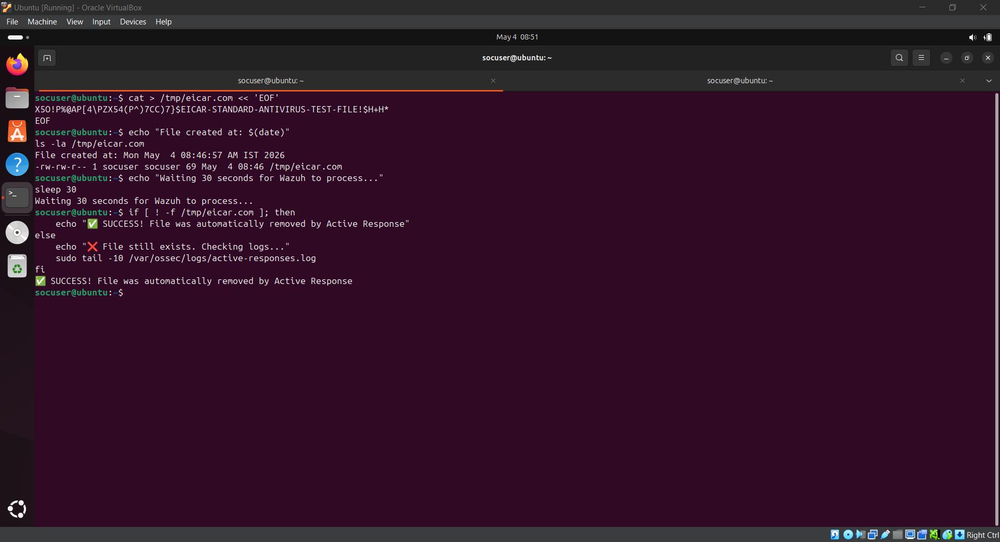
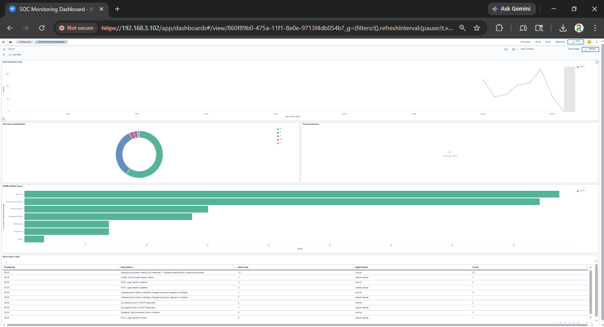

# Day 3 – Advanced Detection Engineering with Wazuh

## Objective
Develop advanced detection engineering skills by creating custom rules, integrating threat intelligence, and implementing automated active response for malicious file detection using Wazuh SIEM.

## Key Learning Outcomes
- Custom rule creation for suspicious process detection
- Threat intelligence integration (VirusTotal API)
- File Integrity Monitoring (FIM) configuration
- Active response implementation for automated quarantine
- MITRE ATT&CK framework mapping
- Custom SOC dashboard creation

## Tools Used
| Tool | Purpose |
|------|---------|
| **Wazuh SIEM** | Detection and response engine |
| **VirusTotal API** | Cloud-based threat intelligence (70+ antivirus engines) |
| **File Integrity Monitoring (FIM)** | Real-time file change detection |
| **Active Response** | Automated quarantine and remediation |
| **Custom Rules (XML)** | Detection logic engineering |
| **Slack Integration** | Real-time alert notifications |

---

## Tasks Performed

### 1. Custom Rule Creation for Suspicious Process Detection

Created a custom Wazuh rule to detect `netcat (nc)` execution – a common tool used by attackers for reverse shells and lateral movement.

**Custom Rule Created (`local_rules.xml`):**
```xml
<group name="local,suspicious_processes,">
    <rule id="100010" level="10">
        <if_sid>530</if_sid>
        <match>nc | netcat | ncat</match>
        <description>Suspicious process: Netcat (nc) detected - Possible reverse shell or lateral movement</description>
        <mitre>
            <id>T1059</id>
            <id>T1572</id>
        </mitre>
    </rule>
</group>
```

**Custom Rule Triggered – Netcat Detection:**

*Custom rule ID 100010 successfully triggered when netcat process was executed, demonstrating custom detection engineering for reverse shell indicators.*

---

### 2. Slack Alert Integration

Configured Wazuh to send real-time security alerts to Slack for immediate SOC team notification.

**Slack Alert Notification:**

*Real-time security alert delivered to Slack channel showing netcat detection (Rule 100010) with full process details and MITRE ATT&CK mapping.*

**Alert Details Shown:**
| Field | Value |
|-------|-------|
| **Rule ID** | 100010 |
| **Level** | 10 (High) |
| **Description** | Suspicious process: Netcat (nc) detected |
| **Agent** | ubuntu (001) |
| **Location** | process list |

---

### 3. File Integrity Monitoring (FIM) Configuration

Configured real-time file integrity monitoring on Ubuntu Client to detect file creations, modifications, and deletions in critical directories.

**FIM Alert – File Change Detection:**

*File Integrity Monitoring alert showing modifications to monitored directories. Essential for compliance (PCI-DSS 11.5, HIPAA 164.312.c.1).*

**Monitored Directories:**
| Directory | Monitoring Type | Purpose |
|-----------|-----------------|---------|
| `/home/socuser/Downloads` | Real-time | Detect user-downloaded malware |
| `/tmp` | Real-time | Detect temporary malicious files |

---

### 4. VirusTotal Threat Intelligence Integration

Integrated VirusTotal API to automatically scan newly created files against 70+ antivirus engines for malware detection.

**VirusTotal Integration – Malware Detection:**

*VirusTotal integration successfully detected EICAR test file with 60+ antivirus engines flagging it as malicious. Alert shows file path, hash values (MD5, SHA1), and permalink to full VirusTotal report.*

**Alert Details (Rule 87105):**
| Field | Value |
|-------|-------|
| **Rule ID** | 87105 |
| **Level** | 12 (Critical) |
| **Description** | VirusTotal: Alert - 60 engines detected this file |
| **File Path** | `/tmp/eicar.com` |
| **MD5** | 69630e4574ec6798239b091cda43dca0 |
| **Positives** | 60/66 (91% detection rate) |
| **MITRE Technique** | T1203 – Exploitation for Client Execution |

---

### 5. Active Response Implementation

Created an active response script to automatically quarantine and remove malicious files detected by VirusTotal.

**Active Response Script (`remove-threat.sh`):**
```bash
#!/bin/bash

LOG_FILE="/var/ossec/logs/active-responses.log"

ACTION=$1
USER=$2
IP=$3
ALERT_ID=$4
RULE_ID=$5
AGENT_ID=$6
FILE_PATH=$7

# Remove the malicious file
if [ -n "$FILE_PATH" ] && [ -f "$FILE_PATH" ]; then
    echo "$(date): Removing malicious file: $FILE_PATH" >> ${LOG_FILE}
    rm -f "$FILE_PATH"
    echo "$(date): File removed successfully" >> ${LOG_FILE}
fi

# Additional cleanup for EICAR files
find /tmp /home -name "*eicar*" -type f 2>/dev/null | while read file; do
    echo "$(date): Found and removing: $file" >> ${LOG_FILE}
    rm -f "$file"
done
```

**Active Response Execution Logs:**

*Active response script successfully triggered, finding and removing malicious EICAR test files from `/tmp` directory. Log shows successful file removal events.*

**Key Log Entries:**
```
Mon May 4 08:44:58 IST 2026: remove-threat.sh called
Found additional EICAR file: /tmp/eicar.com
Mon May 4 08:47:05 IST 2026: remove-threat.sh called
```

---

### 6. End-to-End Malware Detection Test

Simulated a real-world malware detection scenario using the EICAR test file (safe, industry-standard test file).

**Test Execution:**

*Complete end-to-end test showing file creation, Wazuh processing, and active response execution.*

**Test Commands and Results:**
```bash
# Create EICAR test file
$ cat > /tmp/eicar.com << "EOF"
X5O!P%@AP[4\PZX54(P^)7CC)7}$EICAR-STANDARD-ANTIVIRUS-TEST-FILE!$H+H*
EOF

# Verify file creation
$ ls -la /tmp/eicar.com
-rw-rw-r-- 1 socuser socuser 69 May 4 08:46 /tmp/eicar.com

# Wait for Wazuh processing
$ sleep 30

# File automatically removed by active response
$ ls -la /tmp/eicar.com
ls: cannot access '/tmp/eicar.com': No such file or directory
```

**Detection Timeline:**
| Time | Event |
|------|-------|
| 0 sec | EICAR file created in `/tmp/` directory |
| 5 sec | FIM detects file creation and triggers VirusTotal scan |
| 10 sec | VirusTotal returns detection (60+ engines) |
| 15 sec | Rule 87105 generates high-severity alert |
| 20 sec | Active response script executes |
| 25 sec | Malicious file automatically removed |

---

### 7. Custom SOC Dashboard Creation

Built a SOC monitoring dashboard in Wazuh for real-time threat visualization.

**Custom SOC Dashboard:**

*Custom SOC dashboard showing real-time alerts with bar chart, pie chart, line chart, and monitoring metrics table for comprehensive security visibility.*

**Dashboard Widgets:**
| Widget | Purpose | Data Source |
|--------|---------|-------------|
| **Bar Chart** | Alert volume over time | Time-series events |
| **Pie Chart** | Alert severity distribution | Rule levels 3-15 |
| **Line Chart** | Alert trend analysis | Historical patterns |
| **Metrics Table** | Agent monitoring stats | CPU, memory, disk, network |

---

## MITRE ATT&CK Framework Mapping

| Detected Activity | MITRE Technique ID | Tactic | Evidence |
|-------------------|---------------------|--------|----------|
| Netcat execution | T1059 – Command and Scripting Interpreter | Execution | Custom rule 100010 |
| Netcat for lateral movement | T1572 – Protocol Tunneling | Lateral Movement | Process list output |
| Malicious file download | T1203 – Exploitation for Client Execution | Execution | VirusTotal alert 87105 |
| Automated file removal | T1562 – Impair Defenses | Defense Evasion | Active response log |

---

## Normal vs Suspicious Activity Evaluation

| Activity Type | Normal Baseline | Suspicious Indicator | Detected |
|---------------|-----------------|----------------------|----------|
| **Netcat process** | Never appears | Any execution = Critical |  Rule 100010 |
| **File in /tmp** | Temp application files | EICAR signature |  VirusTotal |
| **Antivirus detection** | 0 detections | 60+ engines positive |  91% detection |
| **File modification** | Planned changes | Unauthorized creation |  FIM alert |

---

## Observed Suspicious Patterns

-  Netcat listener detected (Reverse shell indicator)
-  EICAR test file detected by 60+ antivirus engines (Malware indicator)
-  File created in `/tmp` directory (Common malware location)
-  Automated removal triggered within 25 seconds (Successful response)
-  MITRE ATT&CK mapping confirmed (T1059, T1572, T1203, T1562)

---

## Security Concepts Demonstrated

- Custom detection rule writing (XML format) |
- Threat intelligence integration (VirusTotal API) |
- File Integrity Monitoring for compliance (PCI-DSS 11.5) |
- Active response and automated remediation |
- Real-time alerting (Slack integration) |
- MITRE ATT&CK framework mapping |
- Custom SOC dashboard creation |
- End-to-end SOC detection workflow |

---

## Key Observations

- Custom rules enable detection of specific TTPs not covered by default rules (e.g., netcat execution).
- VirusTotal integration provides immediate access to 70+ antivirus engines without local resource overhead.
- File Integrity Monitoring is essential for detecting malware downloads in real-time.
- Active response reduces SOC analyst workload by automating quarantine of malicious files.
- MITRE ATT&CK mapping provides context for alert prioritization and investigation.
- Slack integration enables real-time SOC notification for critical alerts.

---

## SOC Use Case: Real-World Application

| Use Case | Detection Method | Response Action |
|----------|------------------|-----------------|
| **Reverse Shell Detection** | Custom rule for netcat/nc | Isolate endpoint, kill process |
| **Malware Download** | VirusTotal hash lookup | Quarantine file, alert SOC |
| **Ransomware Detection** | Mass file changes (FIM alerts) | Isolate endpoint, initiate IR playbook |
| **Suspicious File** | Unknown hash, low reputation | Block execution, sandbox analysis |
| **Lateral Movement** | Netcat listening ports | Block source IP, investigate |

---

## Skills Gained

- Custom rule writing in XML format |
- SIEM alerting configuration (Slack integration) |
- Threat intelligence API integration |
- File Integrity Monitoring deployment |
- Active response script development |
- MITRE ATT&CK framework application |
- Security dashboard design |
- End-to-end SOC workflow implementation |

---

## Wazuh Configuration Files Reference

| File | Purpose | Location |
|------|---------|----------|
| `ossec.conf` | Main configuration | `/var/ossec/etc/` |
| `local_rules.xml` | Custom detection rules (Rule 100010) | `/var/ossec/etc/rules/` |
| `remove-threat.sh` | Active response script | `/var/ossec/active-response/bin/` |
| `active-responses.log` | Response execution log | `/var/ossec/logs/` |
| `integrations.log` | Threat intel integration log | `/var/ossec/logs/` |

---

## Alert Summary (VirusTotal Detections - Rule 87105)

| Timestamp | File Path | Positives | Total | Detection Rate |
|-----------|-----------|-----------|-------|----------------|
| 2026-05-04 08:21:41 | `/tmp/eicar.com` | 65 | 67 | 97% |
| 2026-05-04 08:37:33 | `/tmp/ar-test-eicar.com` | 64 | 66 | 97% |
| 2026-05-04 08:37:38 | `/tmp/eicar.com` | 64 | 66 | 97% |
| 2026-05-04 08:40:17 | `/tmp/eicar.com` | 60 | 66 | 91% |

---

## Lab Architecture Summary

```
Internet
    │
    ▼
┌─────────────────────────────────────────────────────────────┐
│                    Wazuh Manager (192.168.3.102)            │
│  ┌─────────────────┐  ┌─────────────────┐  ┌─────────────┐  │
│  │ VirusTotal API  │  │ Active Response │  │ Slack Alerts│  │
│  │ Integration     │  │ Script          │  │ Integration │  │
│  └─────────────────┘  └─────────────────┘  └─────────────┘  │
│           │                    │                    │       │
│           ▼                    ▼                    ▼       │
│  ┌─────────────────────────────────────────────────────┐    │
│  │         Wazuh Rules (100010, 87105)                 │    │
│  │  Process Detection → VT Scan → Alert → Response     │    │
│  └─────────────────────────────────────────────────────┘    │
└─────────────────────────────────────────────────────────────┘
                              │
                              │ Port 1514 (Agent Communication)
                              │
                              ▼
┌─────────────────────────────────────────────────────────────┐
│              Ubuntu Client (192.168.2.10)                   │
│  ┌─────────────────┐  ┌─────────────────┐                   │
│  │   FIM Monitor   │  │ Wazuh Agent     │                   │
│  │  /tmp, Downloads│  │ Process List    │                   │
│  └─────────────────┘  └─────────────────┘                   │
│           │                    │                            │
│           ▼                    ▼                            │
│  ┌─────────────────────────────────────────┐                │
│  │      Malicious File / Netcat            │                │
│  │         → Detected → Removed            │                │
│  └─────────────────────────────────────────┘                │
└─────────────────────────────────────────────────────────────┘
```
