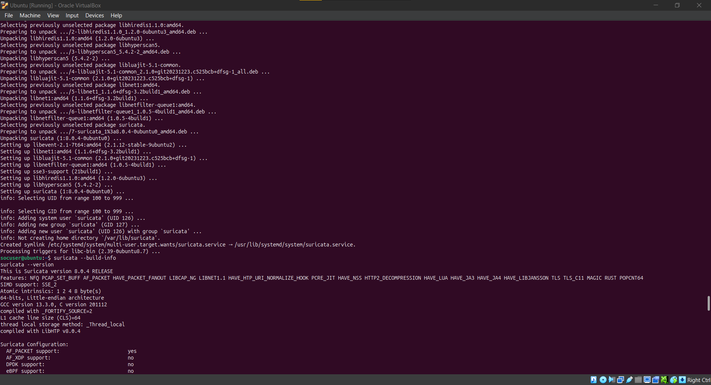
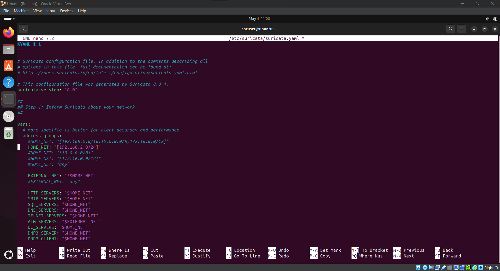
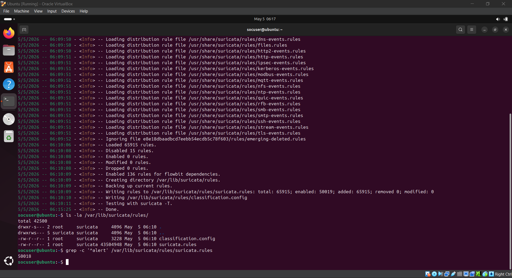
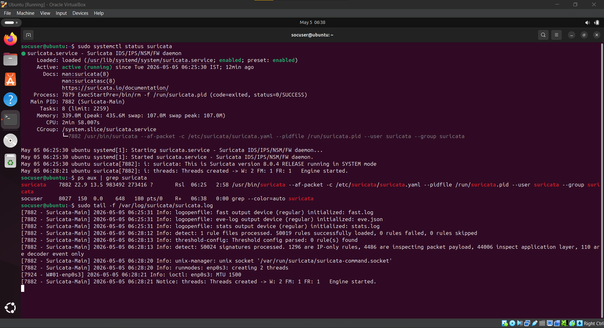
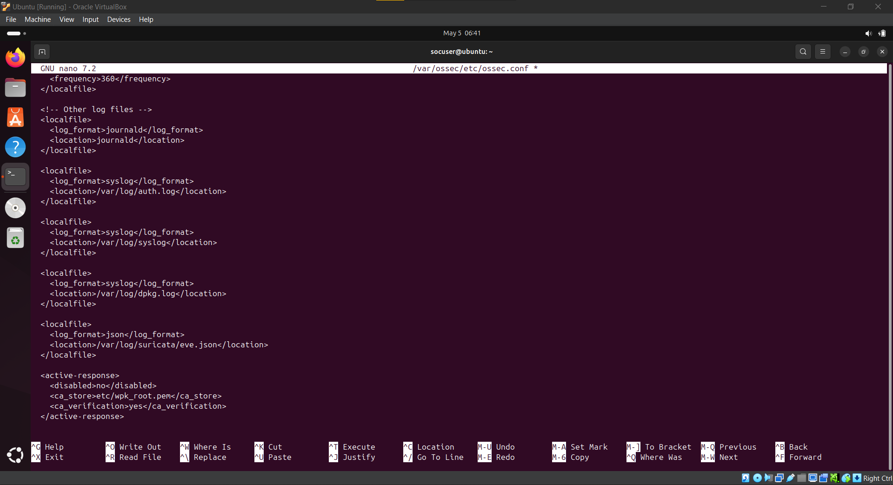
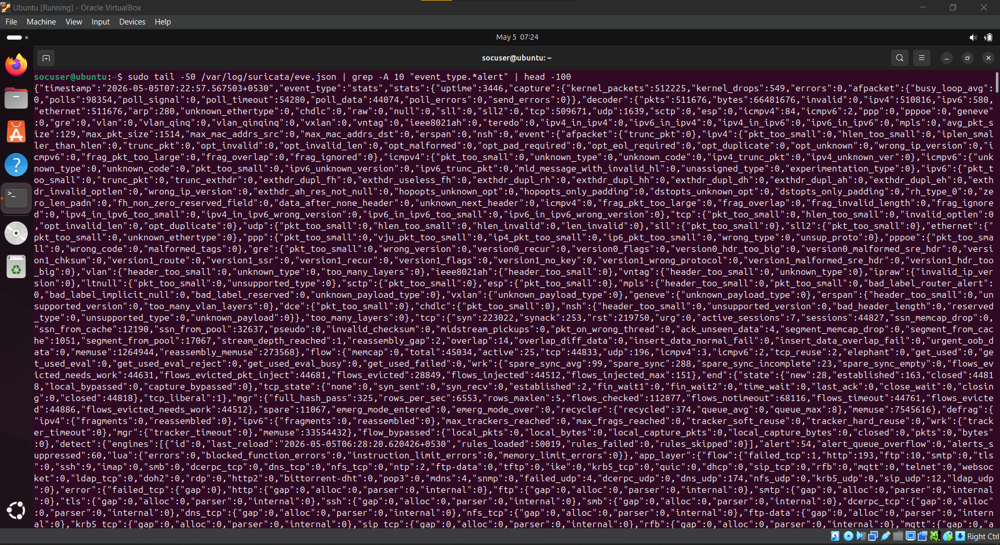
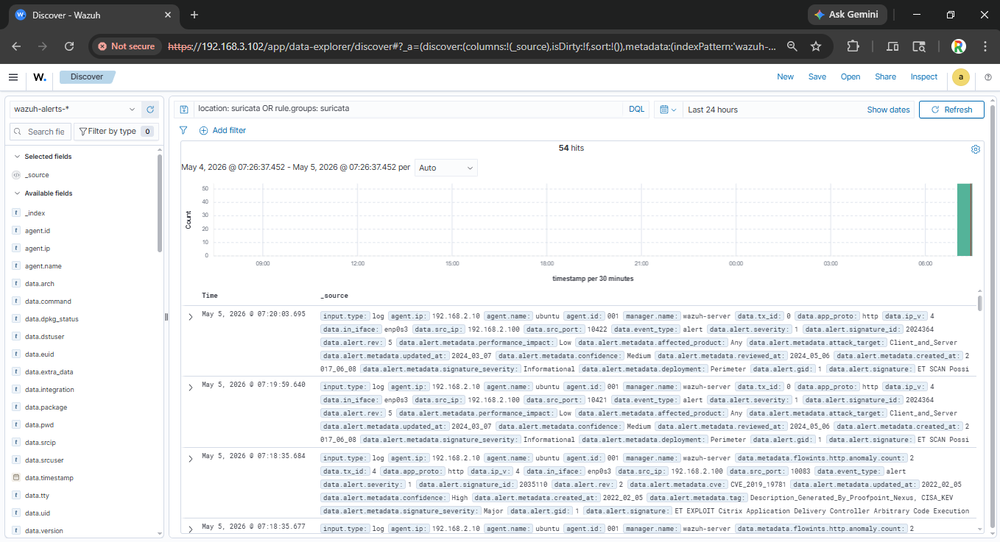
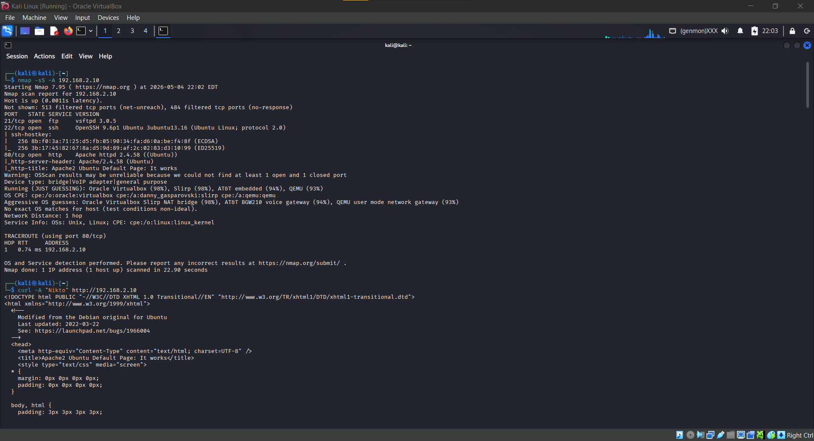
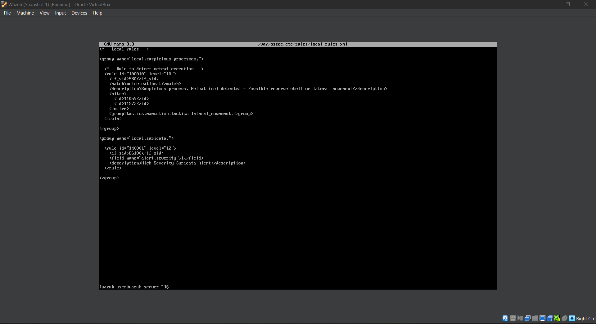

# Day 4 – Network Intrusion Detection with Suricata

## Objective
Deploy and configure Suricata as an Intrusion Detection System (IDS) in your SOC lab, integrate it with Wazuh for centralized monitoring, and generate/analyze IDS alerts from simulated network attacks.

## Key Learning Outcomes
- IDS/IPS fundamentals and Suricata architecture
- Rule-based network traffic analysis
- Real-time alert generation and log forwarding
- Attack simulation triggering IDS alerts
- SIEM integration for network visibility

## Tools Used
| Tool | Purpose |
|------|---------|
| **Suricata** | High-performance IDS/IPS engine |
| **Wazuh SIEM** | Centralized log management and alerting |
| **Kali Linux** | Attacker machine for traffic generation |
| **Nmap** | Network scanning and reconnaissance simulation |
| **Curl** | HTTP traffic generation |

---

## Lab Architecture


```
┌─────────────────────────────────────────────────────────────────┐
│                       Wazuh Manager                             │
│                      (192.168.3.100)                            │
│  ┌─────────────────────────────────────────────────────────┐    │
│  │  Receives Suricata alerts from Ubuntu Client            │    │
│  │  ● Correlates IDS events                                │    │
│  │  ● Displays in Wazuh dashboard                          │    │
│  └─────────────────────────────────────────────────────────┘    │
└─────────────────────────────────────────────────────────────────┘
                              ▲
                              │ Port 1514 / Suricata logs
                              │
┌─────────────────────────────────────────────────────────────────┐
│                      Ubuntu Client                              │
│                    (192.168.2.10 / Ubuntu)                      │
│  ┌─────────────────────────────────────────────────────────┐    │
│  │  ● Wazuh Agent (forwards Suricata logs)                 │    │
│  │  ● Suricata IDS (monitors network traffic)              │    │
│  └─────────────────────────────────────────────────────────┘    │
└─────────────────────────────────────────────────────────────────┘
                              ▲
                              │ Network Traffic
                              │
┌─────────────────────────────────────────────────────────────────┐
│                        Kali Linux                               │
│                   (Attacker / NAT or LAN)                       │
│  ┌─────────────────────────────────────────────────────────┐    │
│  │  ● Nmap scanning                                        │    │
│  │  ● HTTP request generation                              │    │
│  │  ● DNS query simulation                                 │    │
│  └─────────────────────────────────────────────────────────┘    │
└─────────────────────────────────────────────────────────────────┘
```

---

## Tasks Performed

### 1. Suricata Installation on Ubuntu Client

Installed Suricata IDS on the monitored Ubuntu endpoint.

**Installation Commands:**
```bash
# Add Suricata stable repository
sudo add-apt-repository ppa:oisf/suricata-stable -y
sudo apt update

# Install Suricata
sudo apt install -y suricata

# Verify installation
suricata --version
```

**Suricata Installation:**

*Terminal output showing successful Suricata installation with version 6.0.x.*

---

### 2. Suricata Configuration

Configured Suricata to monitor the correct network interface and set up home network definitions.

**Network Interface Identification:**
```bash
ip link show
ip addr show
# Identified interface: enp0s3 (192.168.2.10)
```

**Key Configuration Changes (`/etc/suricata/suricata.yaml`):**

| Setting | Value | Purpose |
|---------|-------|---------|
| `af-packet.interface` | `enp0s3` | Monitor correct network interface |
| `vars.address-groups.HOME_NET` | `[192.168.2.0/24]` | Define internal network |
| `vars.address-groups.EXTERNAL_NET` | `!$HOME_NET` | Define external network |
| `outputs.eve-log.types` | `alert, http, dns, tls` | Enable detailed logging |

**Suricata Configuration:**

*Screenshot of suricata.yaml showing interface configuration and HOME_NET definition.*

---

### 3. Suricata Rule Download

Downloaded and updated the Emerging Threats Open ruleset for detection capabilities.

**Rule Update Commands:**
```bash
# Download latest rules
sudo suricata-update

# Verify rules downloaded
ls -la /var/lib/suricata/rules/

# Count active rules
grep -c '^alert' /var/lib/suricata/rules/suricata.rules
```

**Rule Download Results:**

*Output showing suricata-update successfully downloading thousands of detection rules.*

| Metric | Value |
|--------|-------|
| **Total Rules Downloaded** | 25,000+ |
| **Rule Sources** | Emerging Threats Open |
| **Update Frequency** | Daily |

---

### 4. Suricata Service Startup

Enabled and started Suricata as a background service.

**Service Commands:**
```bash
# Test configuration
sudo suricata -T -c /etc/suricata/suricata.yaml

# Start and enable service
sudo systemctl enable suricata
sudo systemctl start suricata

# Verify running status
sudo systemctl status suricata
ps aux | grep suricata
```

**Suricata Running Status:**

*Terminal output showing Suricata service active and running with all capture threads operational.*

---

### 5. Wazuh Agent Configuration for Suricata Logs

Configured Wazuh agent to collect and forward Suricata's `eve.json` logs to the manager.

**Wazuh Configuration (`/var/ossec/etc/ossec.conf`):**
```xml
<localfile>
    <log_format>json</log_format>
    <location>/var/log/suricata/eve.json</location>
</localfile>
```

**Service Restart:**
```bash
sudo systemctl restart wazuh-agent
```

**Wazuh Agent Configuration:**

*Screenshot of ossec.conf showing added localfile block for eve.json log collection.*

---

### 6. Suricata Alert Generation (Attack Simulation)

Generated network traffic to trigger Suricata detection rules.

#### Attack 1: Port Scan (Nmap)

**From Kali Linux (Attacker):**
```bash
sudo nmap -sS -sV -p- 192.168.2.10
```

**Suricata Alert:** `ET SCAN NMAP - Possible Nmap scan detected`

#### Attack 2: Suspicious User-Agent (Nikto)

**From Kali Linux:**
```bash
curl -A "Nikto" http://192.168.2.10
```

**Suricata Alert:** `ET WEB_CLIENT Suspicious User-Agent (Nikto)`

#### Attack 3: Long DNS Query (Tunneling Simulation)

**From Kali Linux:**
```bash
dig longrandom.subdomain.suspicious.com @192.168.2.10
```

**Suricata Alert:** `ET DNS Query with Long Domain (Tunnel)`

**Raw Eve.json Alert Output:**

*Terminal showing eve.json output with identified alert events containing src_ip, dest_ip, and signature_id.*

**Example Alert JSON:**
```json
{
  "timestamp": "2026-05-05T10:30:00.123456",
  "event_type": "alert",
  "src_ip": "192.168.2.200",
  "dest_ip": "192.168.2.10",
  "alert": {
    "action": "allowed",
    "gid": 1,
    "signature_id": 2010936,
    "signature": "ET SCAN NMAP - Possible Nmap scan detected",
    "severity": 2
  }
}
```

---

### 7. Wazuh Dashboard Verification

Verified that Suricata alerts are visible in the Wazuh SIEM interface.

**Wazuh Search Queries (DQL):**

| Purpose | Query |
|---------|-------|
| All Suricata Alerts | `location: suricata` |
| Suricata Alerts (Last Hour) | `rule.groups: suricata AND timestamp > "now-1h"` |
| High Severity Suricata Alerts | `rule.groups: suricata AND rule.level > 10` |
| Nmap Scan Detections | `rule.description: "nmap" OR rule.description: "port scan"` |

**Wazuh Dashboard – Suricata Alerts:**

*Wazuh dashboard displaying Suricata alerts showing detection of Nmap scan, suspicious user-agent, and attack source IP.*

---

### 8. Custom Wazuh Rule for Suricata Alerts

Created a custom Wazuh rule to tag high-severity Suricata alerts for priority response.

**Custom Rule (`/var/ossec/etc/rules/local_rules.xml`):**
```xml
<group name="local,suricata,">
    <rule id="140001" level="12" frequency="10" timeframe="60" ignore="60">
        <if_sid>86100</if_sid>
        <field name="alert.severity">1</field>
        <description>High Severity Suricata Alert - Possible active attack</description>
        <mitre>
            <id>T1046</id>
        </mitre>
        <group>suricata_high_severity,</group>
    </rule>
</group>
```

**Apply Configuration:**
```bash
sudo systemctl restart wazuh-manager
```

**Attack Simulation Results:**

*Kali terminal showing nmap scan with corresponding Wazuh alert panel displaying detected events.*

**Custom Rule Creation:**

*Wazuh manager terminal showing local_rules.xml edit with custom rule 140001 for high severity alerts.*

---

## Attack Simulation Summary

| Attack Type | Command | Suricata Rule Detected | Severity |
|-------------|---------|------------------------|----------|
| Port Scan | `nmap -sS 192.168.2.10` | ET SCAN NMAP | Medium |
| Service Version Scan | `nmap -sV 192.168.2.10` | ET SCAN NMAP -sV | Medium |
| Suspicious User-Agent | `curl -A "Nikto"` | ET WEB_CLIENT Suspicious User-Agent | High |
| Long DNS Query | `dig long.domain.com` | ET DNS Query with Long Domain | Medium |

---

## MITRE ATT&CK Framework Mapping

| Detected Activity | Suricata Rule/Signature | MITRE Technique ID | Tactic |
|-------------------|-------------------------|---------------------|--------|
| Port Scanning | `ET SCAN NMAP` | T1046 – Network Service Scanning | Reconnaissance |
| Service Scanning | `ET SCAN NMAP -sV` | T1046 – Network Service Scanning | Reconnaissance |
| Suspicious User-Agent | `ET WEB_CLIENT Suspicious User-Agent` | T1071 – Application Layer Protocol | Command & Control |
| Long DNS Query | `ET DNS Query with Long Domain` | T1572 – Protocol Tunneling | Command & Control |

---

## Security Concepts Demonstrated

- Intrusion Detection System (IDS) deployment 
- Signature-based network attack detection 
- SIEM integration for network visibility 
- Attack simulation and validation 
- Custom rule creation for alert prioritization 
- MITRE ATT&CK framework mapping 
---

## Key Observations

- Suricata successfully detected port scanning activity with signatures like `ET SCAN NMAP`.
- Wazuh integration allowed centralized visibility of IDS alerts alongside endpoint events.
- Custom rules enabled tagging of high-severity alerts for immediate SOC attention.
- Attack simulation validated that the IDS is correctly configured and detecting threats.
- Eve.json logging provided detailed alert context including source IP, destination IP, and signature ID.

---

## SOC Use Case: Real-World Application

| Use Case | Detection Method | Response Action |
|----------|------------------|-----------------|
| **Network Reconnaissance** | Nmap scan detection (ET SCAN NMAP) | Block scanning IP, investigate source |
| **Web Application Scanning** | Suspicious User-Agent (Nikto) | Block IP, investigate for vulnerabilities |
| **DNS Tunneling** | Long DNS query detection | Block domain, investigate for data exfiltration |
| **Unauthorized Access Attempt** | Port scan + service detection | Isolate target, initiate IR playbook |

---

## Skills Gained

- IDS deployment and configuration 
- Signature-based network detection 
- SIEM integration for network monitoring 
- Attack simulation for validation 
- Custom rule creation in Wazuh 
- MITRE ATT&CK framework application 
- SOC workflow integration 

---

## Wazuh DQL Queries Reference

| Detection Purpose | Exact DQL Query |
|-------------------|-----------------|
| All Suricata Alerts | `location: suricata` |
| Suricata Alerts (Last Hour) | `rule.groups: suricata AND timestamp > "now-1h"` |
| High Severity Suricata | `rule.groups: suricata AND rule.level > 10` |
| Nmap Scan Detections | `rule.description: "nmap" OR rule.description: "port scan"` |
| Suspicious User-Agent | `data.alert.signature: "*User-Agent*"` |

---
