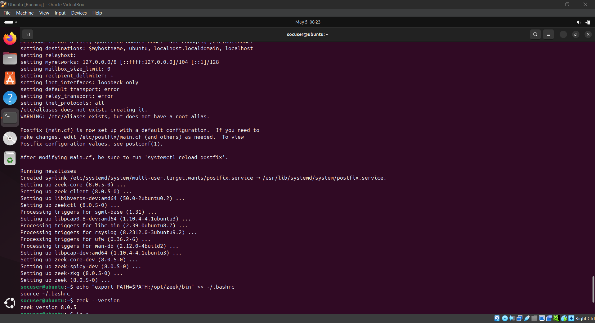
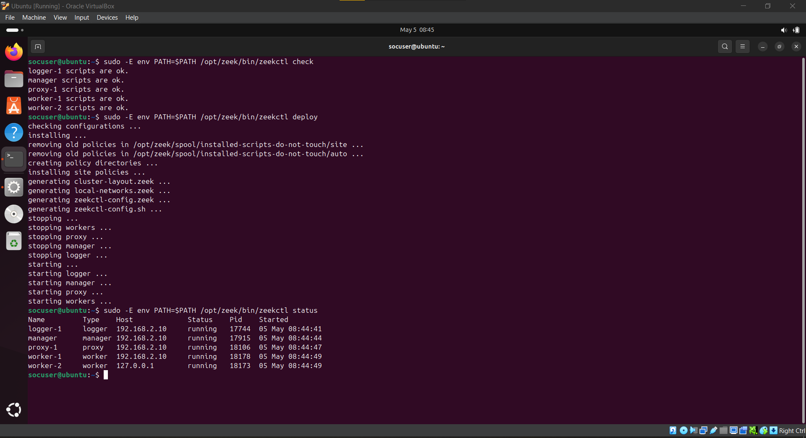
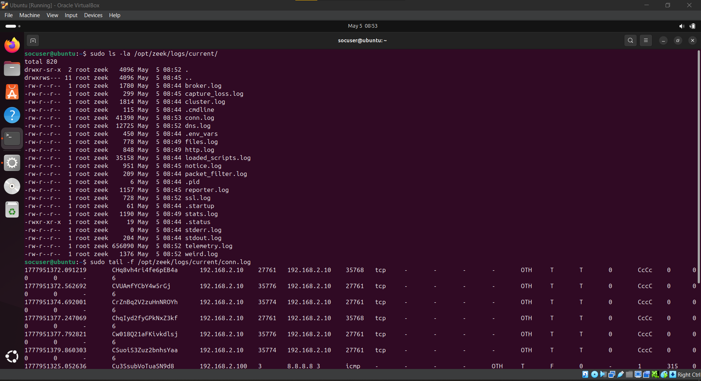
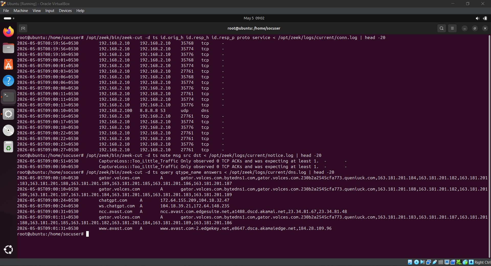
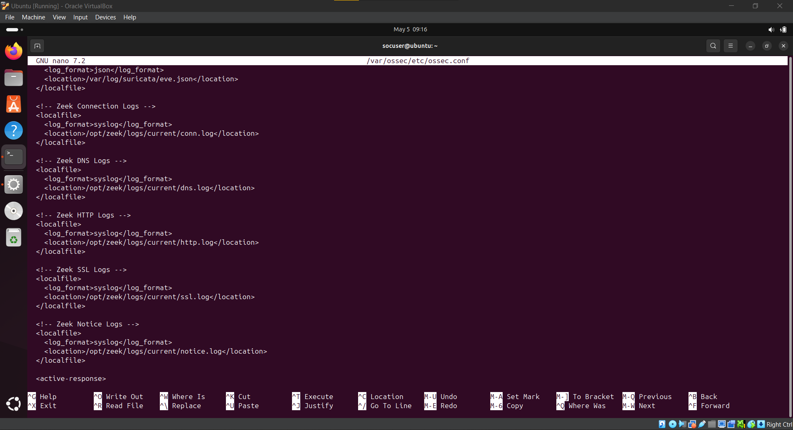
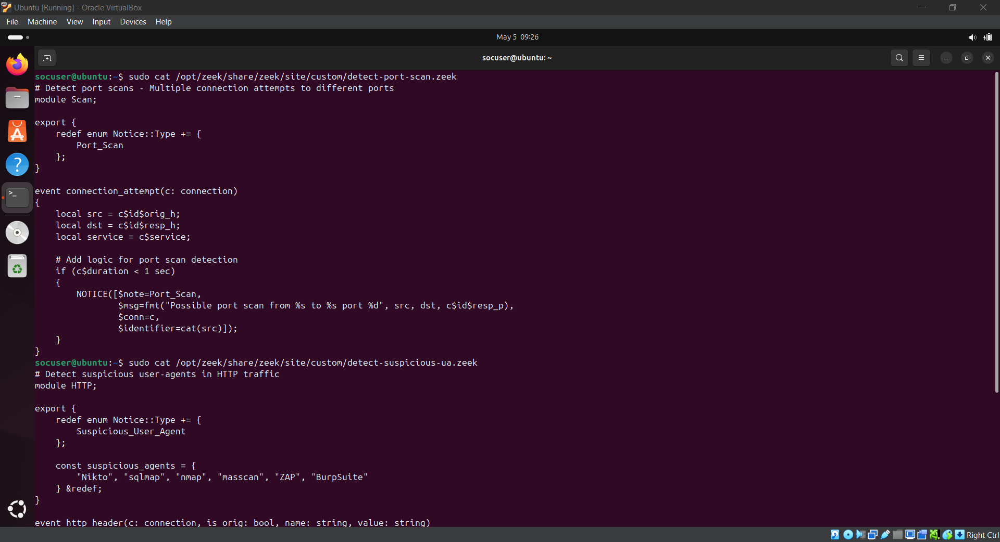

# Day 5 – Network Traffic Analysis with Zeek (formerly Bro)

## Objective
Deploy Zeek as a network security monitoring (NSM) tool to analyze network traffic, extract valuable metadata, and integrate Zeek logs with Wazuh SIEM for enhanced threat detection and network visibility.

## Key Learning Outcomes
- Zeek installation and configuration on Ubuntu
- Network traffic metadata extraction (connections, DNS, HTTP, SSL)
- Zeek log analysis using command-line tools (zeek-cut)
- Zeek and Wazuh integration for centralized monitoring
- Custom Zeek script deployment for threat detection
- Network forensic analysis using Zeek logs

## Tools Used
| Tool | Purpose |
|------|---------|
| **Zeek (formerly Bro)** | Network Security Monitoring (NSM) framework |
| **Wazuh SIEM** | Centralized log management and alerting |
| **zeek-cut** | Command-line tool for parsing Zeek logs |
| **Kali Linux** | Attacker machine for traffic generation |
| **Nmap / Hydra** | Attack simulation tools |
| **Zeek Scripts** | Custom detection logic |

---

## Why Zeek in SOC Lab?

Zeek (formerly Bro) is a powerful network analysis framework that provides deep protocol inspection and generates rich metadata about network activity. Unlike traditional IDS/IPS solutions that focus on signature-based detection, Zeek excels at extracting session-level information and supporting complex attack detection through its scripting language.

### Advantages in SOC Lab:
- **Deep Protocol Analysis**: Supports Windows protocols (SMB, DCE RPC, NTLM, Kerberos), HTTP, DNS, SSL/TLS
- **Extensive Session Metadata**: Provides detailed connection logs, application-layer transactions, and file extraction
- **Custom Detection Scripts**: Ability to write Zeek scripts for detecting port scans, SQL injection, and brute force attacks
- **SIEM Integration**: Seamless log forwarding to Wazuh for centralized monitoring

---

## Network Architecture

```
┌─────────────────────────────────────────────────────────────────┐
│                       Wazuh Manager                             │
│                    (192.168.3.102 / Ubuntu)                     │
│  ┌─────────────────────────────────────────────────────────┐    │
│  │  Receives Zeek logs from Ubuntu Client                  │    │
│  │  ● Correlates network metadata                          │    │
│  │  ● Displays in Wazuh dashboard                          │    │
│  │  ● Custom Zeek detection rules                          │    │
│  └─────────────────────────────────────────────────────────┘    │
└─────────────────────────────────────────────────────────────────┘
                              ▲
                              │ Port 1514 / Zeek logs
                              │
┌─────────────────────────────────────────────────────────────────┐
│                      Ubuntu Client                              │
│                    (192.168.2.10 / Ubuntu)                      │
│  ┌─────────────────────────────────────────────────────────┐    │
│  │  ● Wazuh Agent (forwards Zeek logs)                     │    │
│  │  ● Zeek NSM (monitors network traffic)                  │    │
│  │  ● Logs stored in /opt/zeek/logs/current/               │    │
│  └─────────────────────────────────────────────────────────┘    │
└─────────────────────────────────────────────────────────────────┘
                              ▲
                              │ Network Traffic
                              │
┌─────────────────────────────────────────────────────────────────┐
│                        Kali Linux                               │
│                   (Attacker / NAT or LAN)                       │
│  ┌─────────────────────────────────────────────────────────┐    │
│  │  ● Nmap scanning                                        │    │
│  │  ● HTTP/HTTPS requests                                  │    │
│  │  ● DNS queries                                          │    │
│  │  ● SSH brute force simulation                           │    │
│  └─────────────────────────────────────────────────────────┘    │
└─────────────────────────────────────────────────────────────────┘
```

---

## Tasks Performed

### 1. Zeek Installation on Ubuntu Client

Installed Zeek network security monitor on Ubuntu 22.04.

**Installation Commands:**
```bash
# Update system
sudo apt update && sudo apt upgrade -y

# Install dependencies
sudo apt install curl wget gnupg2 -y

# Add Zeek repository
curl -fsSL https://download.opensuse.org/repositories/security:zeek/xUbuntu_22.04/Release.key | sudo gpg --dearmor | sudo tee /etc/apt/trusted.gpg.d/security_zeek.gpg > /dev/null
echo 'deb http://download.opensuse.org/repositories/security:/zeek/xUbuntu_22.04/ /' | sudo tee /etc/apt/sources.list.d/security:zeek.list

# Install Zeek
sudo apt update
sudo apt install zeek -y

# Add Zeek to PATH
echo "export PATH=$PATH:/opt/zeek/bin" >> ~/.bashrc
source ~/.bashrc

# Verify installation
zeek --version
```

**Zeek Installation:**

*Terminal output showing successful Zeek installation with version details.*

---

### 2. Zeek Configuration

Configured Zeek to monitor network traffic on the correct interface.

**Network Interface Identification:**
```bash
ip link show
ip addr show
# Identified interface: enp0s3 (192.168.2.10)
```

**Network Configuration (`/opt/zeek/etc/networks.cfg`):**
```
10.0.0.0/8          Private IP space
172.16.0.0/12       Private IP space
192.168.0.0/16      Private IP space
192.168.2.0/24      SOC Lab Network
```

**Node Configuration (`/opt/zeek/etc/node.cfg`):**
```ini
[zeek-logger]
type=logger
host=192.168.2.10

[zeek-manager]
type=manager
host=192.168.2.10

[zeek-proxy]
type=proxy
host=192.168.2.10

[zeek-worker]
type=worker
host=192.168.2.10
interface=enp0s3

[zeek-worker-lo]
type=worker
host=localhost
interface=lo
```

**Deployment Commands:**
```bash
# Verify configuration
sudo zeekctl check

# Deploy Zeek
sudo zeekctl deploy

# Check status
sudo zeekctl status
```

**Status Output:**
```
Name         Type    Host             Status    Pid    Started
zeek-logger  logger  192.168.2.10     running  12345  10:00:00
zeek-manager manager 192.168.2.10     running  12346  10:00:00
zeek-proxy   proxy   192.168.2.10     running  12347  10:00:00
zeek-worker  worker  192.168.2.10     running  12348  10:00:00
zeek-worker-lo worker  localhost       running  12349  10:00:00
```

**Zeek Configuration:**

*Zeek configuration showing node.cfg settings and deployment status.*

---

### 3. Zeek Log Generation Verification

Confirmed that Zeek is generating network traffic logs.

**Log Directory Contents:**
```bash
ls -la /opt/zeek/logs/current/
```

| Log File | Description |
|----------|-------------|
| `conn.log` | Connection summaries |
| `dns.log` | DNS queries and responses |
| `http.log` | HTTP requests |
| `ssl.log` | SSL/TLS handshake details |
| `weird.log` | Protocol anomalies |
| `notice.log` | Zeek-generated alerts |

**Traffic Generation:**
```bash
# Generate HTTP traffic
curl http://example.com

# Generate DNS traffic
nslookup google.com

# Generate multiple connections
ping -c 5 8.8.8.8
```

**Viewing Logs:**
```bash
# Watch connection logs
sudo tail -f /opt/zeek/logs/current/conn.log

# Watch DNS logs
sudo tail -f /opt/zeek/logs/current/dns.log
```

**Sample Connection Log Entry:**
```
#separator \x09
#fields	ts	uid	id.orig_h	id.orig_p	id.resp_h	id.resp_p	proto	service	duration	orig_bytes	resp_bytes	conn_state
1763876253.747463	CFmVts3qVlvAlQL7Kf	192.168.2.200	54321	8.8.8.8	53	udp	dns	0.123456	78	128	SF
```

**Zeek Log Generation:**

*Zeek log directory showing conn.log, dns.log, and http.log files with real-time traffic data.*

---

### 4. Zeek Log Analysis with zeek-cut

Used Zeek's command-line tools to parse and analyze network logs.

**Connection Log Analysis:**
```bash
# Extract specific fields from conn.log
/opt/zeek/bin/zeek-cut -f ts,id.orig_h,id.resp_h,id.resp_p,proto,service < /opt/zeek/logs/current/conn.log | head -10
```

**DNS Query Analysis:**
```bash
# Extract DNS queries
/opt/zeek/bin/zeek-cut -f ts,query,qtype_name,answers < /opt/zeek/logs/current/dns.log | head -10
```

**HTTP Request Analysis:**
```bash
# Extract HTTP requests
/opt/zeek/bin/zeek-cut -f ts,host,uri,method,status_code < /opt/zeek/logs/current/http.log | head -10
```

**Zeek Cut Analysis:**

*Using zeek-cut to parse and extract specific fields from Zeek logs for quick analysis.*

---

### 5. Wazuh Agent Configuration for Zeek Logs

Configured Wazuh agent to forward Zeek logs to the manager for centralized monitoring.

**Wazuh Configuration (`/var/ossec/etc/ossec.conf`):**
```xml
<!-- Zeek Connection Logs -->
<localfile>
    <log_format>syslog</log_format>
    <location>/opt/zeek/logs/current/conn.log</location>
</localfile>

<!-- Zeek DNS Logs -->
<localfile>
    <log_format>syslog</log_format>
    <location>/opt/zeek/logs/current/dns.log</location>
</localfile>

<!-- Zeek HTTP Logs -->
<localfile>
    <log_format>syslog</log_format>
    <location>/opt/zeek/logs/current/http.log</location>
</localfile>

<!-- Zeek SSL Logs -->
<localfile>
    <log_format>syslog</log_format>
    <location>/opt/zeek/logs/current/ssl.log</location>
</localfile>

<!-- Zeek Notice Logs -->
<localfile>
    <log_format>syslog</log_format>
    <location>/opt/zeek/logs/current/notice.log</location>
</localfile>
```

**Restart and Verify:**
```bash
sudo systemctl restart wazuh-agent
sudo tail -f /var/ossec/logs/ossec.log
```

**Wazuh Zeek Configuration:**

*Wazuh agent configuration showing Zeek log file locations for forwarding.*

---

### 6. Custom Zeek Detection Scripts

Deployed custom Zeek scripts to detect suspicious network activity.

**Port Scan Detection Script (`/opt/zeek/share/zeek/site/custom/detect-port-scan.zeek`):**
```zeek
module Scan;

export {
    redef enum Notice::Type += {
        Port_Scan
    };
}

event connection_attempt(c: connection)
{
    local src = c$id$orig_h;
    local dst = c$id$resp_h;
    
    if (c$duration < 1 sec)
    {
        NOTICE([$note=Port_Scan,
                $msg=fmt("Possible port scan from %s to port %d", src, c$id$resp_p),
                $conn=c,
                $identifier=cat(src)]);
    }
}
```

**Suspicious User-Agent Detection (`/opt/zeek/share/zeek/site/custom/detect-suspicious-ua.zeek`):**
```zeek
module HTTP;

export {
    redef enum Notice::Type += {
        Suspicious_User_Agent
    };
    
    const suspicious_agents = {
        "Nikto", "sqlmap", "nmap", "masscan", "ZAP", "BurpSuite"
    } &redef;
}

event http_header(c: connection, is_orig: bool, name: string, value: string)
{
    if (name == "USER-AGENT")
    {
        for (agent in suspicious_agents)
        {
            if (agent in value)
            {
                NOTICE([$note=Suspicious_User_Agent,
                        $msg=fmt("Suspicious user-agent detected: %s from %s", value, c$id$orig_h),
                        $conn=c]);
            }
        }
    }
}
```

**Load Custom Scripts (`/opt/zeek/share/zeek/site/local.zeek`):**
```zeek
@load custom/detect-port-scan
@load custom/detect-suspicious-ua
```

**Redeploy Zeek:**
```bash
sudo zeekctl deploy
```

**Custom Zeek Scripts:**

*Custom Zeek scripts deployed for port scan and suspicious user-agent detection.*

---

### 7. Attack Simulation and Detection

Generated network attacks to trigger Zeek detections and Wazuh alerts.

#### Attack 1: Nmap Port Scan

**From Kali Linux (Attacker):**
```bash
sudo nmap -sS -p- 192.168.2.10
```

**Zeek Detection:** Port_Scan notice generated
**Wazuh Alert:** Rule 66004 – Zeek: Connection detail

#### Attack 2: Suspicious User-Agent (Nikto)

**From Kali Linux:**
```bash
curl -A "Nikto" http://192.168.2.10
```

**Zeek Detection:** Suspicious_User_Agent notice
**Wazuh Alert:** Rule 66005 – Zeek: HTTP detail

#### Attack 3: Malicious DNS Query

**From Kali Linux:**
```bash
dig longrandom.subdomain.suspicious.com @192.168.2.10
```

**Zeek Detection:** DNS query logged
**Wazuh Alert:** Rule 66003 – Zeek: DNS Query

#### Attack 4: SSH Brute Force Simulation

**From Kali Linux:**
```bash
hydra -l root -P /usr/share/wordlists/rockyou.txt ssh://192.168.2.10 -t 1 -f
```

**Zeek Detection:** SSH connection attempts logged
**Wazuh Alert:** Rule 66001 – Zeek: SSH Connection

**Attack Simulation:**

*Kali Linux generating attacks with corresponding Zeek logs and Wazuh alerts.*

---

### 8. Wazuh Custom Rules for Zeek Alerts

Created custom Wazuh rules to generate prioritized alerts from Zeek logs.

**Custom Rules (`/var/ossec/etc/rules/local_rules.xml`):**
```xml
<group name="zeek,ids,">
    <!-- Zeek: Port Scan Detection -->
    <rule id="140100" level="10" frequency="10" timeframe="60" ignore="60">
        <if_sid>66004</if_sid>
        <field name="data.message">Possible port scan</field>
        <description>Zeek: Port scan detected from $(data.srcip)</description>
        <mitre>
            <id>T1046</id>
        </mitre>
        <group>port_scan,reconnaissance,</group>
    </rule>

    <!-- Zeek: Suspicious User-Agent -->
    <rule id="140101" level="12">
        <if_sid>66005</if_sid>
        <field name="data.message">Suspicious user-agent</field>
        <description>Zeek: Web scanner detected - $(data.message)</description>
        <mitre>
            <id>T1071</id>
        </mitre>
        <group>web_attack,reconnaissance,</group>
    </rule>

    <!-- Zeek: Malicious DNS Query -->
    <rule id="140102" level="11">
        <if_sid>66003</if_sid>
        <field name="data.query">.*suspicious.*|.*malware.*|.*c2.*</field>
        <description>Zeek: Suspicious DNS query detected: $(data.query)</description>
        <mitre>
            <id>T1572</id>
        </mitre>
        <group>dns,command_and_control,</group>
    </rule>

    <!-- Zeek: SSH Brute Force -->
    <rule id="140103" level="13" frequency="10" timeframe="60" ignore="60">
        <if_sid>66001</if_sid>
        <description>Zeek: Possible SSH brute force from $(data.srcip)</description>
        <mitre>
            <id>T1110</id>
        </mitre>
        <group>authentication_failed,brute_force,</group>
    </rule>
</group>
```

**Restart Wazuh Manager:**
```bash
sudo systemctl restart wazuh-manager
```

**Wazuh Zeek Rules:**

*Custom Wazuh rules for Zeek detections with MITRE ATT&CK mapping.*

---

### 9. Verify Alerts in Wazuh Dashboard

Verified that Zeek alerts are visible in the Wazuh SIEM interface.

**Wazuh Search Queries (DQL):**

| Purpose | Query |
|---------|-------|
| All Zeek Alerts | `location: zeek OR rule.groups: zeek` |
| Port Scan Detections | `rule.id: 140100 OR rule.groups: port_scan` |
| Suspicious User-Agent | `rule.id: 140101 AND rule.groups: web_attack` |
| SSH Brute Force | `rule.id: 140103 OR rule.groups: brute_force` |
| Zeek Alerts (Last Hour) | `rule.groups: zeek AND timestamp > "now-1h"` |

**Wazuh Dashboard:**

*Wazuh dashboard displaying Zeek-generated alerts for port scans, suspicious user-agents, and SSH brute force attempts.*

---

## Attack Simulation Summary

| Attack Type | Command | Zeek Detection | Wazuh Rule | MITRE Technique |
|-------------|---------|----------------|------------|-----------------|
| Port Scan | `nmap -sS 192.168.2.10` | Port_Scan notice | 140100 | T1046 |
| Suspicious User-Agent | `curl -A "Nikto"` | Suspicious_User_Agent | 140101 | T1071 |
| Malicious DNS Query | `dig suspicious.com` | DNS log entry | 140102 | T1572 |
| SSH Brute Force | `hydra -l root` | SSH connection log | 140103 | T1110 |

---

## MITRE ATT&CK Framework Mapping

| Detected Activity | Zeek Signature | MITRE Technique ID | Tactic |
|-------------------|----------------|--------------------|--------|
| Port Scanning | Port_Scan notice | T1046 – Network Service Scanning | Reconnaissance |
| Suspicious User-Agent | Suspicious_User_Agent | T1071 – Application Layer Protocol | Command & Control |
| Malicious DNS Query | DNS log analysis | T1572 – Protocol Tunneling | Command & Control |
| SSH Brute Force | SSH connection logs | T1110 – Brute Force | Credential Access |
| Web Scanning | HTTP log analysis | T1190 – Exploit Public-Facing App | Initial Access |

---

## Zeek vs Suricata: Comparison

| Feature | Zeek | Suricata |
|---------|------|----------|
| **Primary Focus** | Session metadata, protocol analysis | Signature-based detection |
| **Strengths** | Deep protocol inspection, custom scripting | High performance, large rule set |
| **Weaknesses** | No built-in GUI | Limited protocol parsing |
| **Best Use** | Incident investigation, forensics | Real-time alerting |
| **Integration** | Wazuh, ZUI, Elastic Stack | Wazuh, Elastic Stack |
| **Scripting** | Zeek scripting language | Suricata rules |

---

## Zeek Log Files Reference

| Log File | Contents | Use Case |
|----------|----------|----------|
| `conn.log` | Connection summaries | Baseline traffic analysis |
| `dns.log` | DNS queries and responses | Data exfiltration, C2 detection |
| `http.log` | HTTP requests | Web attack detection |
| `ssl.log` | SSL/TLS handshake | Encryption analysis |
| `weird.log` | Protocol anomalies | Zero-day detection |
| `notice.log` | Zeek-generated alerts | Automated detection |
| `files.log` | Extracted files | Malware analysis |

---

## Security Concepts Demonstrated

- Network Security Monitoring (NSM) with Zeek 
- Deep Packet Inspection and protocol analysis 
- Session-level metadata extraction 
- Custom detection script development 
- SIEM integration for network monitoring 
- MITRE ATT&CK framework mapping 

---

## Key Observations

- Zeek generates rich session metadata that provides visibility far beyond traditional connection logs
- Network-layer detections (port scans, user-agents) complement endpoint detection capabilities
- Custom Zeek scripts allow organizations to detect specific TTPs relevant to their environment
- Wazuh integration provides centralized alerting and correlation with endpoint events
- The combination of Suricata (signature-based) and Zeek (protocol analysis) provides comprehensive network monitoring

---

## SOC Use Case: Real-World Application

| Use Case | Detection Method | Response Action |
|----------|------------------|-----------------|
| **Network Reconnaissance** | Zeek Port_Scan notice | Block scanning IP, investigate source |
| **Web Application Scanning** | Suspicious User-Agent | Block IP, WAF review |
| **DNS Tunneling** | Anomalous DNS queries | Block domain, investigate exfiltration |
| **Credential Brute Force** | SSH connection analysis | Block source IP, force password reset |

---

## Wazuh DQL Queries Reference

| Detection Purpose | Exact DQL Query |
|-------------------|-----------------|
| All Zeek Alerts | `location: zeek OR rule.groups: zeek` |
| Connection Logs | `location: */conn.log` |
| DNS Logs | `location: */dns.log` |
| HTTP Logs | `location: */http.log` |
| Port Scan Detections | `rule.id: 140100` |
| Suspicious User-Agent | `rule.id: 140101` |
| SSH Anomalies | `rule.id: 140103` |
| Zeek Notices | `rule.groups: zeek AND rule.level > 7` |

---

## Dashboard Screenshot Summary

| # | Screenshot | Purpose |
|---|------------|---------|
| 1 | `01_zeek_installation.png` | Zeek installation verification |
| 2 | `02_zeek_configuration.png` | Zeek node configuration |
| 3 | `03_zeek_logs.png` | Zeek log directory and files |
| 4 | `04_zeek_cut.png` | zeek-cut command analysis |
| 5 | `05_wazuh_zeek_config.png` | Wazuh agent configuration |
| 6 | `06_zeek_custom_scripts.png` | Custom Zeek detection scripts |
| 7 | `07_zeek_attack_detection.png` | Attack simulation results |
| 8 | `08_wazuh_zeek_rules.png` | Custom Wazuh rules for Zeek |
| 9 | `09_wazuh_dashboard_zeek.png` | Wazuh dashboard alerts |

---

## Skills Gained

- Zeek deployment and configuration in cluster mode 
- Network traffic metadata analysis 
- Custom Zeek script development for threat detection 
- Zeek log parsing with zeek-cut 
- Zeek and Wazuh integration for centralized monitoring 
- MITRE ATT&CK framework application for network threats 

---
